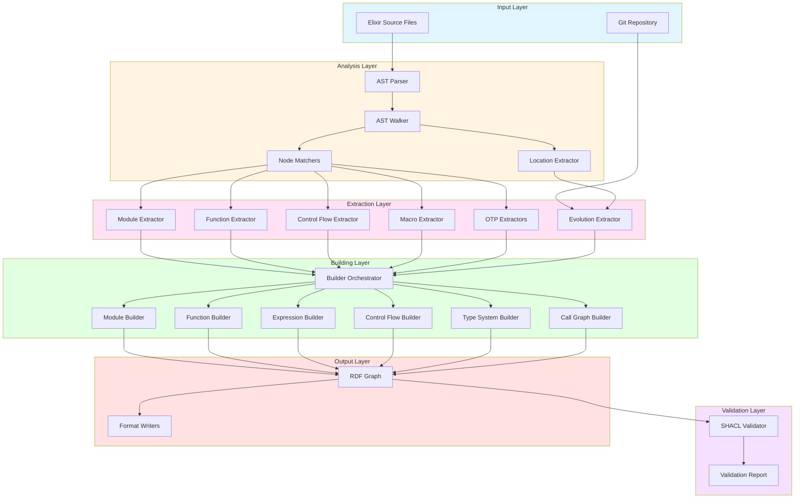
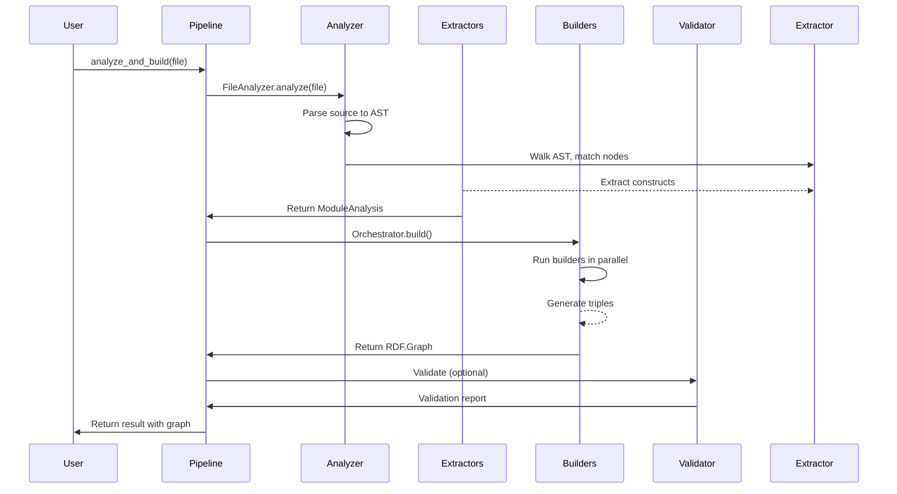
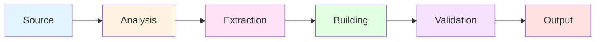
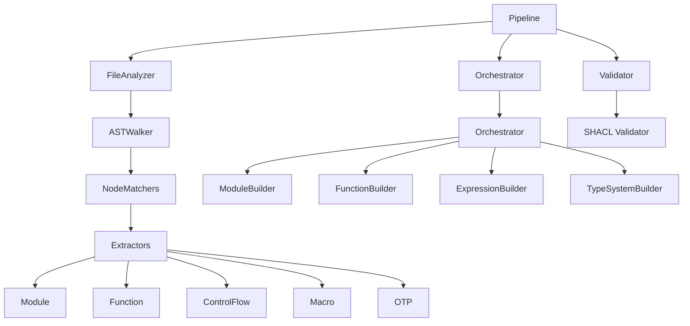
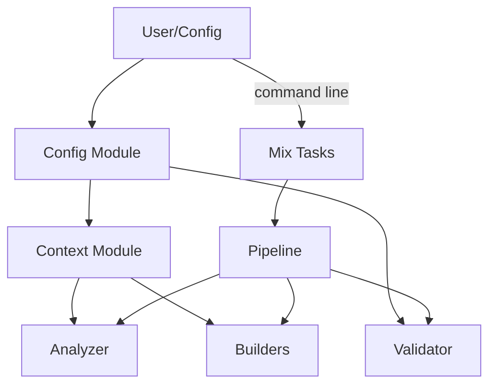

# Architecture Overview

This guide explains the architecture of the Elixir Ontologies system - how the components work together to transform Elixir source code into semantic knowledge graphs.

## Table of Contents

- [System Overview](#system-overview)
- [Architecture Diagram](#architecture-diagram)
- [Component Layers](#component-layers)
- [Data Flow](#data-flow)
- [Key Design Decisions](#key-design-decisions)
- [Parallel Execution](#parallel-execution)
- [Extension Points](#extension-points)

## System Overview

The Elixir Ontologies system is a pipeline that transforms Elixir source code into RDF knowledge graphs. It processes source files, extracts structural information, and generates semantic triples following OWL ontology definitions.

**Input**: Elixir source code (`.ex`, `.exs` files) or git repositories
**Output**: RDF knowledge graphs in Turtle, N-Triples, or JSON-LD format
**Processing**: Modular, parallel pipeline with configurable extraction depth

## Architecture Diagram



## Component Layers

### 1. Input Layer

**Purpose**: Accepts and prepares source code for analysis

**Components**:
- `FileReader` - Reads Elixir source files from filesystem
- `Git` - Extracts provenance information from git repositories
- `Parser` - Converts source code to Elixir AST using `Code.string_to_quoted/1`

**Key Module**: `ElixirOntologies.Analyzer.FileReader`

### 2. Analysis Layer

**Purpose**: Traverses and categorizes AST nodes

**Components**:
- `ASTWalker` - Recursive traversal of Elixir AST
- `NodeMatchers` - Pattern matching on AST node types
- `Location` - Extracts file position and line/column information
- `ProjectAnalyzer` - Coordinates multi-file project analysis

**Key Modules**:
- `ElixirOntologies.Analyzer.ASTWalker`
- `ElixirOntologies.Analyzer.Matchers`
- `ElixirOntologies.Analyzer.Location`
- `ElixirOntologies.Analyzer.ProjectAnalyzer`

### 3. Extraction Layer

**Purpose**: Extracts specific code constructs from AST

**Components**:

| Extractor | Purpose | Extracts |
|----------|---------|----------|
| **Module** | Module declarations | Name, attributes, nesting, documentation |
| **Function** | Function definitions | Name, arity, clauses, guards, visibility |
| **ControlFlow** | Control flow expressions | if/unless, case, cond, receive, try |
| **Macro** | Macro definitions | Name, clauses, expansion |
| **OTP** | OTP patterns | GenServer, Supervisor, Agent, Task, ETS |
| **Evolution** | Git history | Commits, authors, timestamps, changesets |

**Key Modules**: `ElixirOntologies.Extractors.*`

### 4. Building Layer

**Purpose**: Converts extracted data to RDF triples

**Components**:

| Builder | Purpose | Generates |
|---------|---------|----------|
| **Orchestrator** | Coordinates all builders | Complete graphs |
| **ModuleBuilder** | Module entities | Module triples |
| **FunctionBuilder** | Function entities | Function triples |
| **ClauseBuilder** | Function clauses | Clause triples |
| **ExpressionBuilder** | Expressions | AST expression triples |
| **ControlFlowBuilder** | Control flow | If/case/cond/receive triples |
| **TypeSystemBuilder** | Typespecs | Type expression triples |
| **CallGraphBuilder** | Call relationships | Module dependency triples |
| **ExceptionBuilder** | Exceptions | Try/rescue/catch triples |

**OTP Builders**:
- `GenServerBuilder` - GenServer callbacks
- `SupervisorBuilder` - Supervision trees
- `AgentBuilder` - Agent state
- `TaskBuilder` - Task specifications

**Evolution Builders**:
- `CommitBuilder` - Commit metadata
- `ActivityBuilder` - Change activities
- `VersionBuilder` - Version snapshots

**Key Modules**: `ElixirOntologies.Builders.*`

### 5. Validation Layer

**Purpose**: Ensures generated graphs conform to ontology constraints

**Components**:
- `SHACL` - SHACL validator implementation
- `Report` - Validation report generation
- `Validator` - High-level validation API

**Key Modules**:
- `ElixirOntologies.SHACL.*`
- `ElixirOntologies.Validator.*`

### 6. Output Layer

**Purpose**: Serializes and formats RDF graphs

**Components**:
- `Graph` - RDF graph data structure
- Format writers - Turtle, N-Triples, JSON-LD serializers

**Key Module**: `ElixirOntologies.Graph`

## Data Flow



### Detailed Pipeline Flow

1. **Parsing**: Source code → Elixir AST (`Code.string_to_quoted/1`)

2. **Walking**: AST → Node stream (`ASTWalker.walk/1`)

3. **Matching**: Node → Construct type (`NodeMatchers`)

4. **Extracting**: Node → Structured data (`Extractors`)

5. **Building**: Data → RDF triples (`Builders`)

6. **Aggregating**: Triples → RDF.Graph (`Graph.merge/2`)

7. **Validating**: Graph → Report (optional, `Validator`)

8. **Serializing**: Graph → File (Turtle, N-Triples, JSON-LD)

## Key Design Decisions

### 1. Separation of Concerns

- **Extractors** extract but don't build RDF
- **Builders** build but don't parse
- Clean separation enables independent testing and extension

### 2. Parallel Execution

Two levels of parallelism:
1. **Module-level**: Multiple files processed concurrently
2. **Builder-level**: Within a module, builders run concurrently

### 3. Pipeline Architecture



Each stage produces an intermediate result:
- **Analysis**: `ModuleAnalysis` struct
- **Extraction**: Structured maps
- **Building**: `RDF.Graph`
- **Validation**: `ValidationReport`

### 4. Context Propagation

The `Context` struct propagates configuration through the pipeline:

```elixir
%Context{
  base_iri: "https://example.org/code#",
  include_source_text: false,
  include_git_info: true,
  include_expressions: false,
  mode: :light_or_full,
  iri_counter: 0,
  file_path: "lib/my_app.ex"
}
```

### 5. FunctionalProperty for Single Values

OWL `FunctionalProperty` ensures properties like `arity` have single values:

```turtle
:arity a owl:DatatypeProperty ;
    a owl:FunctionalProperty .
```

### 6. RDF Lists for Ordering

Clauses use RDF lists to preserve evaluation order:

```turtle
:hasClause [
    rdf:first <#clause/0> ;
    rdf:rest [rdf:first <#clause/1> ; rdf:rest rdf:nil]
] .
```

## Parallel Execution

### Module-Level Parallelism

```elixir
# In ProjectAnalyzer
Enum.map(files, fn file ->
  Task.async(fn -> analyze_file(file) end)
end)
|> Task.await_many(timeout)
```

### Builder-Level Parallelism

```elixir
# In Orchestrator
builders = [
    {&FunctionBuilder.build/3, functions},
    {&ProtocolBuilder.build/3, protocols},
    {&BehaviourBuilder.build/3, behaviours},
    ...
]

Task.async_stream(builders, fn {builder_fun, data} ->
  builder_fun.(data, context)
end, max_concurrency: System.schedulers_online())
|> Enum.to_list()
```

## Extension Points

### Adding a New Extractor

1. Create module in `lib/elixir_ontologies/extractors/`
2. Call from `ASTWalker` via `NodeMatchers`
3. Return structured data (not RDF triples)

Example:
```elixir
defmodule ElixirOntologies.Extractors.MyConstruct do
  @moduledoc """
  Extracts my custom construct from AST.
  """

  alias ElixirOntologies.Analyzer.ASTWalker

  def extract({:my_construct, _meta, args}, context) do
    # Extract and return structured data
    %{
      type: :my_construct,
      name: extract_name(args),
      options: extract_options(args)
    }
  end
end
```

### Adding a New Builder

1. Create module in `lib/elixir_ontologies/builders/`
2. Register in `Orchestrator` (optional)
3. Generate RDF triples

Example:
```elixir
defmodule ElixirOntologies.Builders.MyConstructBuilder do
  @moduledoc """
  Builds RDF triples for my custom construct.
  """

  alias ElixirOntologies.{Core, Helpers}

  def build(data, context) do
    construct_iri = fresh_iri(context.base_iri, "my_construct")

    [
      Helpers.type_triple(construct_iri, Core.MyConstruct),
      Helpers.datatype_property(construct_iri, Core.name(), data.name, RDF.XSD.String)
    ]
  end
end
```

### Extending the Ontology

1. Edit `priv/ontologies/elixir-core.ttl` (or appropriate ontology file)
2. Add new classes and properties
3. Update SHACL shapes in `elixir-shapes.ttl`
4. Create builder to generate triples

See: **[Developer Getting Started Guide](getting-started.md)**

### Adding a New Output Format

1. Implement serializer for `ElixirOntologies.Graph`
2. Add to `output_format` config option
3. Update `mix elixir_ontologies.analyze` task

## Component Relationships



## File Organization

```
lib/elixir_ontologies/
├── analyzer/              # Analysis layer
│   ├── file_analyzer.ex
│   ├── project_analyzer.ex
│   ├── ast_walker.ex
│   ├── matchers.ex
│   ├── location.ex
│   └── git/
├── extractors/           # Extraction layer
│   ├── module.ex
│   ├── function.ex
│   ├── control_flow.ex
│   ├── macro.ex
│   ├── literal.ex
│   ├── operator.ex
│   ├── pattern.ex
│   ├── directive/
│   ├── otp/
│   └── evolution/
├── builders/             # Building layer
│   ├── orchestrator.ex
│   ├── module_builder.ex
│   ├── function_builder.ex
│   ├── clause_builder.ex
│   ├── expression_builder.ex
│   ├── control_flow_builder.ex
│   ├── type_system_builder.ex
│   ├── call_graph_builder.ex
│   ├── context.ex
│   ├── helpers.ex
│   ├── otp/
│   └── evolution/
├── shacl/                # Validation layer
│   ├── validators/
│   └── model/
├── validator.ex          # High-level validation API
├── pipeline.ex           # End-to-end pipeline
├── config.ex            # Configuration
├── graph.ex             # RDF graph wrapper
├── iri.ex               # IRI generation
└── utils/               # Utility functions
```

## Configuration Flow



## Performance Characteristics

| Operation | Complexity | Notes |
|-----------|-----------|-------|
| File parsing | O(n) | Linear in file size |
| AST walking | O(n) | Linear in AST nodes |
| Extraction | O(n) | Per extractor, linear |
| Building | O(n) | Per builder, linear |
| Validation | O(n²) | SHACL validation can be expensive |
| Serialization | O(n) | Linear in triples |

**Optimizations**:
- Parallel file processing
- Parallel builder execution
- Lazy evaluation (on-demand extraction)
- Incremental analysis (changesets only)

## Related Documentation

- **[Getting Started Guide](getting-started.md)** - How to extend the system
- **[Extractor Components](components/extractors.md)** - Extractor internals
- **[Builder Components](components/builders.md)** - Builder internals
- **[Validator Components](components/validators.md)** - Validation internals
- **[SHACL Components](components/shacl.md)** - SHACL implementation

## References

- [Pipeline Module](../../../lib/elixir_ontologies/pipeline.ex)
- [Orchestrator Module](../../../lib/elixir_ontologies/builders/orchestrator.ex)
- [Context Module](../../../lib/elixir_ontologies/builders/context.ex)
