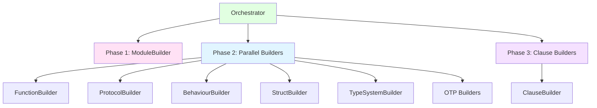
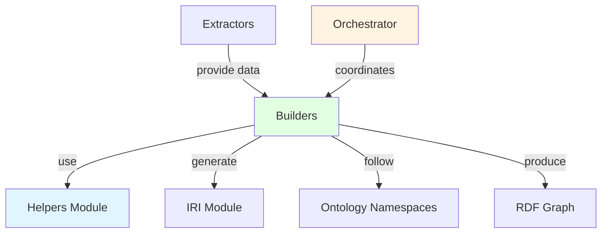

# Builders Component Guide

## Overview

The **Builders** layer transforms structured data from extractors into RDF triples following the Elixir ontology definitions. Each builder specializes in generating triples for specific code constructs while maintaining consistency with the ontology schema.

**Location**: `lib/elixir_ontologies/builders/`

## Purpose

Builders are responsible for:
- Converting extractor output to RDF triples
- Generating IRIs for code entities
- Creating ontology-compliant type assertions
- Building datatype and object properties
- Managing blank nodes for complex structures
- Coordinating through the Orchestrator pattern

## Design Philosophy

Builders follow these principles:

1. **No parsing** - Builders consume structured data, they don't parse AST
2. **RDF-first** - All output is RDF triples (IRI, predicate, object)
3. **IRI generation** - Consistent IRI patterns for entity identification
4. **Type correctness** - Adherence to XSD datatypes and ontology classes
5. **Triple composition** - Using Helpers for common triple patterns
6. **Light vs Full mode** - Conditional expression building based on context

## Builder Modules

### Core Builders

| Module | Builds | Input | Output |
|--------|--------|-------|--------|
| **ModuleBuilder** | Module entities | `Module.t()` | Module IRIs + triples |
| **FunctionBuilder** | Function entities | `Function.t()` | Function IRIs + triples |
| **ClauseBuilder** | Function clauses | `Clause.t()` | Clause IRIs + triples |
| **ProtocolBuilder** | Protocol definitions | `Protocol.t()` | Protocol IRIs + triples |
| **BehaviourBuilder** | Behaviour definitions | `Behaviour.t()` | Behaviour IRIs + triples |
| **StructBuilder** | Struct definitions | `Struct.t()` | Struct IRIs + triples |

### Expression Builders

| Module | Builds | Input | Output |
|--------|--------|-------|--------|
| **ExpressionBuilder** | AST expressions | AST nodes | Expression IRIs + triples |
| **ControlFlowBuilder** | Control flow structures | `Conditional`, `Case`, etc. | Expression IRIs + triples |
| **TypeSystemBuilder** | Types and specs | `TypeDefinition`, `FunctionSpec` | Type IRIs + triples |
| **PatternBuilder** | Pattern matching | Pattern AST | Pattern IRIs + triples |

### OTP Builders

| Module | Builds | Location |
|--------|---------|----------|
| **GenServerBuilder** | GenServer callbacks | `builders/otp/` |
| **SupervisorBuilder** | Supervision trees | `builders/otp/` |
| **AgentBuilder** | Agent state | `builders/otp/` |
| **TaskBuilder** | Task specifications | `builders/otp/` |

### Evolution Builders

| Module | Builds | Location |
|--------|---------|----------|
| **CommitBuilder** | Git commit metadata | `builders/evolution/` |
| **ActivityBuilder** | Change activities | `builders/evolution/` |
| **VersionBuilder** | Version snapshots | `builders/evolution/` |

## Common Builder Patterns

### Builder Return Type

All builders return tagged tuples:

```elixir
{entity_iri, [triple1, triple2, ...]}
```

Where:
- `entity_iri` - The IRI of the entity being built
- `triples` - List of RDF triples `{subject, predicate, object}`

### Triple Generation via Helpers

Builders use `Helpers` module for common triple patterns:

```elixir
# Type assertion triple
Helpers.type_triple(subject_iri, Structure.Module)

# Datatype property triple
Helpers.datatype_property(subject_iri, Structure.moduleName(), "MyApp", RDF.XSD.String)

# Object property triple
Helpers.object_property(function_iri, Structure.belongsTo(), module_iri)
```

### IRI Generation

Builders generate consistent IRIs using the `IRI` module:

```elixir
# Module IRI: base#MyApp.User
IRI.for_module(base_iri, "MyApp.User")

# Function IRI: base#MyApp.User/greet/1
IRI.for_function(base_iri, "MyApp.User", :greet, 1)

# Type IRI: base#MyApp.User/type/t/0
IRI.for_type(base_iri, "MyApp.User", :t, 0)
```

### Blank Node Generation

For complex structures without persistent IRIs:

```elixir
# Create anonymous blank node
node = Helpers.blank_node()

# Create labeled blank node (for debugging)
node = Helpers.blank_node("expression_body")
```

## Example: Module Builder

### Input Data

```elixir
%ElixirOntologies.Extractors.Module{
  type: :module,
  name: [:MyApp, :User],
  docstring: "User management module",
  aliases: [
    %{module: [:Enum], as: :E}
  ],
  imports: [],
  requires: [],
  uses: [],
  functions: [
    %{name: :new, arity: 1, visibility: :public}
  ],
  macros: [],
  types: [],
  location: %Location{file: "lib/my_app/user.ex", line: 1, column: 7},
  metadata: %{parent_module: nil, has_moduledoc: true}
}
```

### Output Triples

```turtle
<#MyApp.User> a struct:Module ;
    struct:moduleName "MyApp.User" ;
    struct:docstring "User management module" ;
    struct:aliasesModule <#Enum> ;
    struct:containsFunction <#MyApp.User/new/1> ;
    core:hasSourceLocation <#lib/my_app/user.ex#L1> .
```

### Implementation Pattern

```elixir
def build(module_info, context) do
  # Generate module IRI
  module_iri = generate_module_iri(module_info, context)

  # Build all triples
  triples =
    [
      build_type_triple(module_iri, module_info),
      build_name_triple(module_iri, module_info)
    ] ++
      build_docstring_triple(module_iri, module_info) ++
      build_directive_triples(module_iri, module_info, context) ++
      build_containment_triples(module_iri, module_info, context)

  # Deduplicate
  triples = List.flatten(triples) |> Enum.uniq()

  {module_iri, triples}
end
```

## Example: Function Builder

### Input Data

```elixir
%ElixirOntologies.Extractors.Function{
  type: :function,
  name: :greet,
  arity: 1,
  min_arity: 1,
  visibility: :public,
  docstring: "Greets the user",
  clauses: [
    %{params: [%{name: :name}], guards: [], body: {:__block__, [], [...]}}
  ],
  location: %Location{file: "lib/my_app/user.ex", line: 5},
  metadata: %{module: [:MyApp, :User]}
}
```

### Output Triples

```turtle
<#MyApp.User/greet/1> a struct:Function, struct:PublicFunction ;
    struct:functionName "greet" ;
    struct:arity 1 ;
    struct:belongsTo <#MyApp.User> ;
    struct:hasClause <#MyApp.User/greet/1/clause/0> ;
    struct:docstring "Greets the user" ;
    core:hasSourceLocation <#lib/my_app/user.ex#L5> .
```

### Implementation Pattern

```elixir
def build(function_info, context) do
  function_iri = generate_function_iri(function_info, context)

  triples =
    [
      build_type_triple(function_iri, function_info),
      build_name_triple(function_iri, function_info),
      build_arity_triple(function_iri, function_info)
    ] ++
      build_belongs_to_triple(function_iri, function_info, context) ++
      build_docstring_triple(function_iri, function_info) ++
      build_clause_triples(function_info, function_iri, context)

  triples = List.flatten(triples) |> Enum.uniq()

  {function_iri, triples}
end
```

## Example: Type System Builder

### Type Definition Input

```elixir
%ElixirOntologies.Extractors.TypeDefinition{
  name: :user_t,
  arity: 0,
  visibility: :public,
  parameters: [],
  expression: {:map, [], [key_type: :atom, value_type: :any]},
  location: nil,
  metadata: %{}
}
```

### Output Triples

```turtle
<#MyApp/type/user_t/0> a struct:PublicType ;
    struct:typeName "user_t" ;
    struct:typeArity 0 ;
    struct:referencesType [
        a struct:MapType ;
        struct:keyType [a struct:BasicType ; struct:typeName "atom"] ;
        struct:valueType [a struct:BasicType ; struct:typeName "any"]
    ] .
```

### Function Spec Input

```elixir
%ElixirOntologies.Extractors.FunctionSpec{
  name: :get_user,
  arity: 1,
  spec_type: :spec,
  parameter_types: [{:integer, [], []}],
  return_type: {:user_t, [], []},
  type_constraints: %{},
  location: nil,
  metadata: %{}
}
```

### Output Triples

```turtle
<#MyApp.User/get_user/1> a struct:FunctionSpec ;
    struct:hasSpec <#MyApp.User/get_user/1> .
```

## Light Mode vs Full Mode

### Light Mode (Default)

Builders create minimal triples with boolean flags:

```turtle
<#MyApp/foo/0> a struct:Function ;
    struct:hasIfExpression true .
```

### Full Mode (with ExpressionBuilder)

Builders create complete expression trees:

```turtle
<#MyApp/foo/0> a struct:Function ;
    core:hasBody <#expr/body/0> .

<#expr/body/0> a core:IfExpression ;
    core:hasCondition <#expr/condition> ;
    core:hasThenBranch <#expr/then> ;
    core:hasElseBranch <#expr/else> .
```

### Enabling Full Mode

```elixir
# Context configuration
context = Context.new(
  base_iri: "https://example.org/code#",
  include_expressions: true,
  file_path: "lib/my_app.ex"  # Project code only
)

# Pass to builder
ControlFlowBuilder.build_conditional(
  conditional,
  context,
  expression_builder: ExpressionBuilder  # Required for full mode
)
```

## Integration with Orchestrator

The `Orchestrator` coordinates all builders:



### Execution Phases

1. **Phase 1**: Module builder runs first (establishes module IRIs)
2. **Phase 2**: All module-level builders run in parallel
3. **Phase 3**: Clause builders run (depend on function IRIs from Phase 2)
4. **Aggregation**: All triples combined into single RDF.Graph

## Helper Functions Reference

### Type Triples

```elixir
# Single type assertion
Helpers.type_triple(subject, class)

# Dual typing (base + specialized)
Helpers.dual_type_triples(subject, PROV.Activity, Evolution.Creation)
```

### Datatype Properties

```elixir
# String property
Helpers.datatype_property(subject, predicate, "value", RDF.XSD.String)

# Integer property
Helpers.datatype_property(subject, predicate, 42, RDF.XSD.Integer)

# Optional property (returns nil if value is nil)
Helpers.optional_string_property(subject, predicate, nil)
Helpers.optional_datetime_property(subject, predicate, DateTime.utc_now())
```

### Object Properties

```elixir
# Link two resources
Helpers.object_property(subject, predicate, object_iri)
```

### RDF Lists

```elixir
# Build ordered list
items = [item1_iri, item2_iri, item3_iri]
{list_head, list_triples} = Helpers.build_rdf_list(items)

# Result:
# list_head => [rdf:first item1, rdf:rest [rdf:first item2, rdf:rest [rdf:first item3, rdf:rest rdf:nil]]]
```

### Triple Processing

```elixir
# Flatten and deduplicate lists of triples
triples = Helpers.finalize_triples([triple_list1, triple_list2, nil])

# Filter triples by subject
module_triples = Helpers.filter_by_subject(all_triples, module_iri)
```

## Extension Points

### Adding a New Builder

1. **Create builder module** in `builders/`:

```elixir
defmodule ElixirOntologies.Builders.MyConstructBuilder do
  @moduledoc """
  Builds RDF triples for my custom construct.
  """

  alias ElixirOntologies.Builders.{Context, Helpers}
  alias ElixirOntologies.{IRI, NS}
  alias NS.Structure

  @doc """
  Builds RDF triples for my construct.
  """
  def build(data, context) do
    entity_iri = generate_iri(data, context)

    triples =
      [
        Helpers.type_triple(entity_iri, Structure.MyConstruct),
        Helpers.datatype_property(entity_iri, Structure.name(), data.name, RDF.XSD.String)
      ]

    {entity_iri, triples}
  end

  defp generate_iri(data, context) do
    # Generate IRI using consistent pattern
    RDF.iri("#{context.base_iri}my_construct/#{data.name}")
  end
end
```

2. **Register in Orchestrator**:

```elixir
# In Orchestrator.build/2
my_construct_triples = MyConstructBuilder.build(my_construct_data, context)
```

3. **Add ontology class** (if needed):

```turtle
:MyConstruct a owl:Class ;
    rdfs:subClassOf :Entity .
```

### Adding a New Helper Function

```elixir
# In builders/helpers.ex
@doc """
  Creates a custom triple pattern.
  """
@spec custom_pattern(RDF.IRI.t(), term()) :: RDF.Triple.t()
def custom_pattern(subject, value) do
  {subject, CustomNS.predicate(), RDF.XSD.integer(value)}
end
```

## Relationships



## Key Functions Reference

### Module Builder

| Function | Purpose |
|----------|---------|
| `build/2` | Main build function |
| `generate_module_iri/2` | Create module IRI |
| `build_name_triple/2` | Module name property |
| `build_directive_triples/3` | Alias/import/require/use |

### Function Builder

| Function | Purpose |
|----------|---------|
| `build/2` | Main build function |
| `generate_function_iri/2` | Create function IRI |
| `build_arity_triple/2` | Arity property |
| `build_clause_triples/3` | Delegate to ClauseBuilder |

### Type System Builder

| Function | Purpose |
|----------|---------|
| `build_type_definition/3` | Build @type triples |
| `build_function_spec/3` | Build @spec triples |
| `build_type_expression/2` | Build type expression AST |

### Control Flow Builder

| Function | Purpose |
|----------|---------|
| `build_conditional/3` | Build if/unless/cond |
| `build_case/3` | Build case expressions |
| `build_with/3` | Build with expressions |
| `build_receive/3` | Build receive expressions |
| `build_try/3` | Build try/rescue/catch |

## Related Components

- **[Architecture Overview](../architecture.md)** - System-wide architecture
- **[Extractor Components](extractors.md)** - How extractors feed builders
- **[Validator Components](validators.md)** - How built graphs are validated
- **[SHACL Components](shacl.md)** - Constraint validation

## References

- [Module Builder](../../../lib/elixir_ontologies/builders/module_builder.ex)
- [Function Builder](../../../lib/elixir_ontologies/builders/function_builder.ex)
- [Orchestrator](../../../lib/elixir_ontologies/builders/orchestrator.ex)
- [Helpers](../../../lib/elixir_ontologies/builders/helpers.ex)
- [Expression Builder](../../../lib/elixir_ontologies/builders/expression_builder.ex)
- [Control Flow Builder](../../../lib/elixir_ontologies/builders/control_flow_builder.ex)
- [Type System Builder](../../../lib/elixir_ontologies/builders/type_system_builder.ex)
