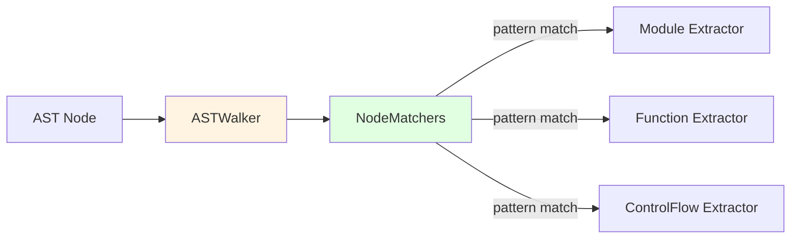
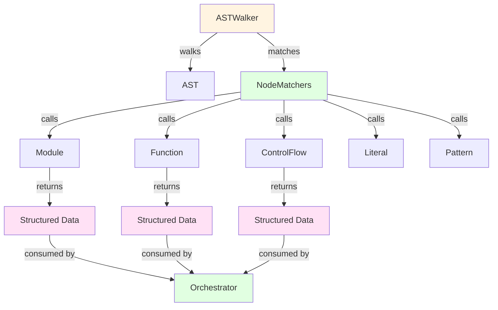

# Extractors Component Guide

## Overview

The **Extractors** layer transforms parsed Elixir AST nodes into structured data that can be consumed by builders to generate RDF triples. Each extractor specializes in a specific language construct.

**Location**: `lib/elixir_ontologies/extractors/`

## Purpose

Extractors are responsible for:
- Pattern matching on AST node types
- Extracting relevant information from AST
- Structuring data for downstream consumption
- Maintaining source location information

## Design Philosophy

Extractors follow these principles:

1. **No RDF generation** - Extractors extract, builders build
2. **Structured output** - Return typed structs for clarity
3. **Composability** - Each extractor handles one construct
4. **Location tracking** - All extraction includes source position
5. **Graceful degradation** - Missing data returns `nil` or empty lists

## Extractor Modules

### Core Extractors

| Module | Extracts | AST Pattern |
|--------|---------|-------------|
| **Module** | Module declarations, aliases, imports | `{:defmodule, _, _}` |
| **Function** | Function definitions, delegates | `{:def, _, _}`, `{:defp, _, _}` |
| **Clause** | Function clauses, guards | `{:->, _, _}` |
| **Macro** | Macro definitions | `{:defmacro, _, _}` |
| **Operator** | Operators | `{:op, _, _}` |
| **Literal** | Literals (atoms, integers, strings, etc.) | Various literal forms |
| **Pattern** | Pattern matching constructs | Various pattern forms |
| **Guard** | Guard expressions | Guard clause syntax |

### Specialized Extractors

| Module | Extracts | Notes |
|--------|---------|-------|
| **ControlFlow** | if/unless/case/cond/receive/try | Complex multi-clause constructs |
| **Block** | do blocks, begin blocks | Expression sequences |
| **Comprehension** | for/into comprehensions | List/bitstring comprehensions |
| **Call** | Function calls, remote/local | `{{:., _, _}, _, _}` |
| **Capture** | Capture operator (`&`) | `{:&, _, _}` |
| **Pipe** | Pipe operator (`|>`) | `{:|>, _, _}` |
| **Quote** | Quote expressions | `{:quote, _, _}` |
| **MacroInvocation** | Compile-time macro calls | Special handling |
| **Reference** | Module/function references | Alias references |
| **ReturnExpression** | Return statements | `{:return, _, _}` |

### OTP Extractors

| Module | Extracts | Location |
|--------|---------|----------|
| **GenServer** | GenServer callback definitions | `extractors/otp/` |
| **Supervisor** | Supervisor trees, child specs | `extractors/otp/` |
| **Agent** | Agent usage patterns | `extractors/otp/` |
| **Task** | Task specifications | `extractors/otp/` |
| **ETS** | ETS table creation/access | `extractors/otp/` |

### Evolution Extractors

| Module | Extracts | Purpose |
|--------|---------|---------|
| **Commit** | Git commit metadata | Author, timestamp, SHA |
| **Activity** | Change activities | Creation, modification, deprecation |
| **Changeset** | Version diffs | Additions, deletions |

### Directive Extractors

| Module | Extracts | Pattern |
|--------|---------|---------|
| **Alias** | `alias` directives | `{:alias, _, _}` |
| **Import** | `import` directives | `{:import, _, _}` |
| **Require** | `require` directives | `{:require, _, _}` |
| **Use** | `use` directives | `{:use, _, _}` |

## Common Patterns

### Extractor Return Type

All extractors return tagged tuples:

```elixir
{:ok, result_struct}  # Success
{:error, reason}       # Failure with reason
```

### Result Structure

```elixir
%{
  type: :function,
  name: :my_function,
  arity: 2,
  visibility: :public,
  docstring: "Documentation here",
  clauses: [...],
  location: %SourceLocation{file: "lib/my_app.ex", line: 42},
  metadata: %{has_doc: true}
}
```

### Type Detection Pattern

```elixir
defmodule MyExtractor do
  @doc """
  Checks if AST node represents this construct.
  """
  def my_construct?({:my_construct, _meta, _args}), do: true
  def my_construct?(_), do: false

  @doc """
  Extracts construct from AST node.
  """
  def extract({:my_construct, meta, args}, context) do
    location = extract_location(meta, context)
    data = extract_data(args)

    {:ok, %__MODULE__{
      type: :my_construct,
      data: data,
      location: location
    }}
  end
end
```

## Integration with AST Walker

Extractors are invoked by the `ASTWalker` via `NodeMatchers`:



## Example: Module Extractor

### Input AST

```elixir
{:defmodule, [line: 1, column: 7], [
  {:__aliases__, [line: 1, column: 16], [:MyApp, :User]},
  [do: [
    {:def, [line: 2, column: 3], [{:list, [], nil}, [do: nil]]},
    {:@moduledoc, [line: 1], ["User module documentation"]},
  ]]
]}
```

### Extraction Result

```elixir
%{
  type: :module,
  name: [:MyApp, :User],
  docstring: "User module documentation",
  aliases: [],
  imports: [],
  requires: [],
  uses: [],
  functions: [%{name: :list, arity: 0, visibility: :public}],
  macros: [],
  types: [],
  location: %SourceLocation{
    file: "lib/my_app/user.ex",
    line: 1,
    column: 7
  },
  metadata: %{
    has_moduledoc: true,
    parent_module: nil
  }
}
```

## Example: Function Extractor

### Input AST

```elixir
{:def, [line: 5, column: 3], [
  {:greet, [line: 5, column: 7], [{:name, [], nil}, [do: {:__block__, [], ["Hello ", name]}]]}
]}
```

### Extraction Result

```elixir
%{
  type: :function,
  name: :greet,
  arity: 1,
  min_arity: 1,
  visibility: :public,
  docstring: nil,
  clauses: [
    %{
      type: :clause,
      params: [%{name: :name, type: :var}],
      guards: [],
      body: {:__block__, [], ["Hello ", name]},
      location: %SourceLocation{line: 5, column: 3}
    }
  ],
  location: %SourceLocation{
    file: "lib/my_app/user.ex",
    line: 5,
    column: 3
  },
  metadata: %{}
}
```

## Example: Control Flow Extractor

### Input AST (Case Expression)

```elixir
{:case, [line: 10], [
  {:->, [], [
    [{:error, [], [{:message, [], nil}]}],
    [do: :error]
  ]},
  {:->, [], [
    [value],
    [do: {:ok, value}]
  ]}
]}
```

### Extraction Result

```elixir
%{
  type: :case_expression,
  expression: nil,  # No expression before clauses
  clauses: [
    %{
      index: 0,
      pattern: %{type: :struct_pattern, module: :error, fields: [:message]},
      body: :error,
      location: %SourceLocation{line: 10}
    },
    %{
      index: 1,
      pattern: %{type: :variable_pattern, name: :value},
      body: {:ok, value},
      location: %SourceLocation{line: 11}
    }
  ],
  location: %SourceLocation{line: 10}
}
```

## Extension Points

### Adding a New Extractor

1. **Create extractor module** in `extractors/`:

```elixir
defmodule ElixirOntologies.Extractors.MyConstruct do
  @moduledoc """
  Extracts my custom construct from AST.
  """

  alias ElixirOntologies.Analyzer.Location

  defstruct [
    :type,
    :name,
    :options,
    :location
  ]

  @doc """
  Checks if AST node represents this construct.
  """
  def my_construct?({:my_construct, _meta, _args}), do: true
  def my_construct?(_), do: false

  @doc """
  Extracts construct from AST.
  """
  def extract({:my_construct, meta, args}, context) do
    location = Location.extract(meta, context)
    {name, options} = parse_args(args)

    {:ok, %__MODULE__{
      type: :my_construct,
      name: name,
      options: options,
      location: location
    }}
  end

  defp parse_args(args) do
    # Parse constructor arguments
    {:default, []}
  end
end
```

2. **Register in NodeMatchers**:

```elixir
# In lib/elixir_ontologies/analyzer/matchers.ex
def my_construct?(ast), do: Extractors.MyConstruct.my_construct?(ast)
```

3. **Create corresponding builder** in `builders/`:

```elixir
defmodule ElixirOntologies.Builders.MyConstructBuilder do
  alias ElixirOntologies.{Core, Helpers}

  def build(data, context) do
    construct_iri = fresh_iri(context.base_iri, "my_construct")

    [
      Helpers.type_triple(construct_iri, Core.MyConstruct),
      Helpers.datatype_property(construct_iri, Core.name(), data.name, RDF.XSD.String)
    ]
  end
end
```

## Relationships



## Key Functions Reference

### Module Extractor

| Function | Purpose |
|----------|---------|
| `module?/1` | Type check for module nodes |
| `extract/2` | Main extraction function |
| `extract_name/1` | Extract module name from aliases |
| `extract_docstring/2` | Extract @moduledoc |
| `extract_directives/1` | Extract alias/import/require/use |

### Function Extractor

| Function | Purpose |
|----------|---------|
| `function?/1` | Type check for function nodes |
| `extract/2` | Main extraction function |
| `extract_arity/1` | Calculate arity from parameters |
| `extract_visibility/1` | Determine public/private |
| `extract_docstring/2` | Extract @doc |

### Control Flow Extractor

| Function | Purpose |
|----------|---------|
| `case_expression?/1` | Type check for case expressions |
| `cond_expression?/1` | Type check for cond expressions |
| `receive_expression?/1` | Type check for receive expressions |
| `try_expression?/1` | Type check for try expressions |
| `extract_clauses/2` | Extract clause patterns and bodies |

## Related Components

- **[Architecture Overview](../architecture.md)** - System-wide architecture
- **[Builders Component](builders.md)** - How builders consume extractor output
- **[AST Walker](../architecture.md#analysis-layer)** - How extractors are invoked

## References

- [Module Extractor](../../../lib/elixir_ontologies/extractors/module.ex)
- [Function Extractor](../../../lib/elixir_ontologies/extractors/function.ex)
- [Control Flow Extractor](../../../lib/elixir_ontologies/extractors/control_flow.ex)
- [Node Matchers](../../../lib/elixir_ontologies/analyzer/matchers.ex)
