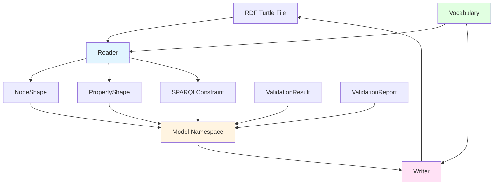
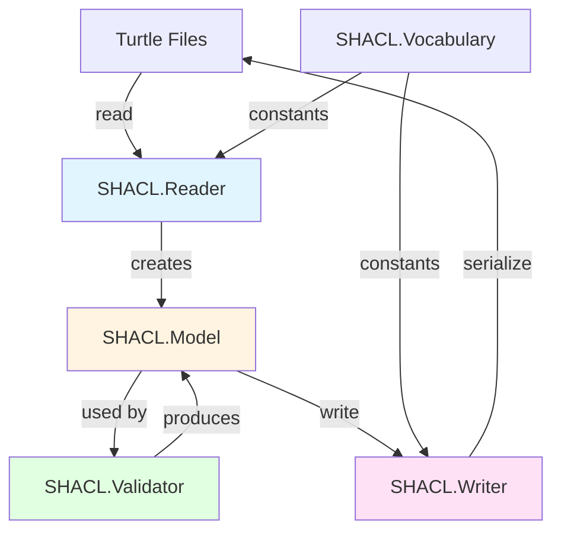

# SHACL Component Guide

## Overview

The **SHACL Component** provides the data model and serialization for SHACL (Shapes Constraint Language) validation. It defines Elixir structs representing SHACL concepts and handles reading/writing SHACL RDF graphs.

**Location**: `lib/elixir_ontologies/shacl/`

## Purpose

The SHACL Component is responsible for:
- Defining Elixir structs for SHAML concepts (NodeShape, PropertyShape, etc.)
- Reading SHACL shapes from RDF Turtle files
- Writing validation reports to RDF Turtle format
- Providing vocabulary constants for SHACL terms
- Managing validation result structures

## Design Philosophy

The SHACL Component follows these principles:

1. **W3C Compliance** - Strict adherence to SHACL specification
2. **Elixir-first** - Native Elixir structs for SHACL concepts
3. **Bidirectional** - Both read and write SHACL RDF
4. **Type-safe** - Strongly-typed structs with @type specs
5. **Extensible** - Easy to add new constraint types

## Component Architecture



## Core Modules

### SHACL.Vocabulary

Centralized IRI constants for SHACL vocabulary terms:

```elixir
alias ElixirOntologies.SHACL.Vocabulary, as: SHACL

# Core classes
SHACL.node_shape()         # => ~I<http://www.w3.org/ns/shacl#NodeShape>
SHACL.validation_report()  # => ~I<http://www.w3.org/ns/shacl#ValidationReport>
SHACL.validation_result()  # => ~I<http://www.w3.org/ns/shacl#ValidationResult>

# Constraints
SHACL.min_count()          # => ~I<http://www.w3.org/ns/shacl#minCount>
SHACL.pattern()            # => ~I<http://www.w3.org/ns/shacl#pattern>
SHACL.datatype()           # => ~I<http://www.w3.org/ns/shacl#datatype>

# Report predicates
SHACL.conforms()           # => ~I<http://www.w3.org/ns/shacl#conforms>
SHACL.focus_node()         # => ~I<http://www.w3.org/ns/shacl#focusNode>
SHACL.result_message()     # => ~I<http://www.w3.org/ns/shacl#resultMessage>

# Severity
SHACL.violation()          # => ~I<http://www.w3.org/ns/shacl#Violation>
SHACL.warning()            # => ~I<http://www.w3.org/ns/shacl#Warning>
SHACL.info()               # => ~I<http://www.w3.org/ns/shacl#Info>
```

**Purpose**: Single source of truth for all SHACL IRIs used across the codebase

### SHACL.Model

Defines Elixir structs for SHACL concepts:

| Module | Represents | Purpose |
|--------|------------|---------|
| **NodeShape** | `sh:NodeShape` | Shape targeting nodes with constraints |
| **PropertyShape** | `sh:PropertyShape` | Shape constraining a property |
| **ValidationResult** | `sh:ValidationResult` | Single validation result |
| **ValidationReport** | `sh:ValidationReport` | Aggregated validation report |
| **SPARQLConstraint** | `sh:SPARQLConstraint` | SPARQL-based validation |

### SHACL.Reader

Parses SHACL shapes from RDF graphs into Elixir structs:

```elixir
# Parse shapes from Turtle file
{:ok, shapes_graph} = RDF.Turtle.read_file("elixir-shapes.ttl")
{:ok, node_shapes} = SHACL.Reader.parse_shapes(shapes_graph)

# Each NodeShape contains PropertyShapes
Enum.each(node_shapes, fn node_shape ->
  IO.puts("Shape: #{node_shape.id}")
  IO.puts("  Targets: #{inspect(node_shape.target_classes)}")
  IO.puts("  Properties: #{length(node_shape.property_shapes)}")
end)
```

**Key Functions**:
- `parse_shapes/1` - Extract all NodeShapes from graph
- `parse_property_shapes/2` - Extract PropertyShapes for a NodeShape
- `parse_sparql_constraints/2` - Extract SPARQL constraints

### SHACL.Writer

Serializes validation reports to RDF Turtle format:

```elixir
# Convert report to Turtle
{:ok, turtle} = SHACL.Writer.to_turtle(validation_report)

IO.puts(turtle)
# Output:
# @prefix sh: <http://www.w3.org/ns/shacl#> .
#
# [] a sh:ValidationReport ;
#     sh:conforms false ;
#     sh:result [
#         a sh:ValidationResult ;
#         sh:focusNode <#MyModule> ;
#         sh:resultSeverity sh:Violation ;
#         sh:resultMessage "Required property missing"
#     ] .
```

**Key Functions**:
- `to_graph/1` - Convert ValidationReport to RDF.Graph
- `to_turtle/1` - Convert ValidationReport to Turtle string

## Model Structures

### NodeShape

Represents a `sh:NodeShape` with constraints for focus nodes:

```elixir
%NodeShape{
  # Identification
  id: ~I<https://w3id.org/elixir-code/shapes#FunctionShape>,

  # Targeting (how to select focus nodes)
  target_classes: [~I<https://w3id.org/elixir-code/structure#Function>],
  target_nodes: [],
  implicit_class_target: nil,

  # Constraints
  property_shapes: [
    %PropertyShape{
      path: ~I<https://w3id.org/elixir-code/structure#functionName>,
      min_count: 1,
      pattern: ~r/^[a-z][a-zA-Z0-9_]*$/
    }
  ],
  sparql_constraints: [],

  # Node-level constraints (applied to focus node itself)
  node_class: nil,
  node_datatype: nil,
  node_pattern: nil,

  # Logical operators
  node_and: nil,
  node_or: nil,
  node_xone: nil,
  node_not: nil
}
```

### PropertyShape

Represents a `sh:PropertyShape` constraining a property:

```elixir
%PropertyShape{
  # Identification
  id: ~I<https://w3id.org/elixir-code/shapes#FunctionNameProperty>,

  # Property path (which property to constrain)
  path: ~I<https://w3id.org/elixir-code/structure#functionName>,

  # Cardinality constraints
  min_count: 1,
  max_count: 1,

  # Type constraints
  datatype: ~I<http://www.w3.org/2001/XMLSchema#string>,
  class: nil,

  # String constraints
  pattern: ~r/^[a-z][a-zA-Z0-9_]*$/,
  min_length: nil,
  max_length: nil,

  # Value constraints
  in: nil,
  node_kind: nil,

  # Qualified value shapes
  qualified_value_shape: nil,
  qualified_min_count: nil
}
```

### ValidationResult

Represents a single validation result:

```elixir
%ValidationResult{
  # The node that was validated
  focus_node: ~I<https://example.org/code#MyApp.invalid_func>,

  # The property path (for property constraints)
  path: ~I<https://w3id.org/elixir-code/structure#functionName>,

  # The shape that was violated
  source_shape: ~I<https://w3id.org/elixir-code/shapes#FunctionShape>,

  # Severity level
  severity: :violation,  # :violation | :warning | :info

  # Human-readable message
  message: "Function name must start with lowercase letter",

  # Additional details
  details: %{}
}
```

### ValidationReport

Aggregates validation results:

```elixir
%ValidationReport{
  # Overall conformance (true if no violations)
  conforms?: false,

  # All validation results
  results: [
    %ValidationResult{
      focus_node: ~I<...>,
      severity: :violation,
      message: "..."
    }
  ],

  # Optional graph URIs
  shapes_graph_uri: "https://w3id.org/elixir-code/shapes",
  data_graph_uri: "https://example.org/code"
}
```

## SHACL Shapes to Elixir Mapping

### NodeShape Fields

| SHACL Property | Elixir Field | Type | Description |
|----------------|--------------|------|-------------|
| `sh:targetClass` | `target_classes` | `[RDF.IRI.t()]` | Target RDF classes |
| `sh:targetNode` | `target_nodes` | `[RDF.Term.t()]` | Direct node targets |
| `sh:property` | `property_shapes` | `[PropertyShape.t()]` | Property constraints |
| `sh:sparql` | `sparql_constraints` | `[SPARQLConstraint.t()]` | SPARQL constraints |
| `sh:and` | `node_and` | `[term()]` | Logical AND |
| `sh:or` | `node_or` | `[term()]` | Logical OR |
| `sh:xone` | `node_xone` | `[term()]` | Logical XOR |
| `sh:not` | `node_not` | `term()` | Logical NOT |
| `sh:datatype` | `node_datatype` | `RDF.IRI.t()` | Datatype constraint |
| `sh:class` | `node_class` | `RDF.IRI.t()` | Class constraint |
| `sh:pattern` | `node_pattern` | `Regex.t()` | Pattern constraint |

### PropertyShape Fields

| SHACL Property | Elixir Field | Type | Description |
|----------------|--------------|------|-------------|
| `sh:path` | `path` | `RDF.IRI.t()` | Property path |
| `sh:minCount` | `min_count` | `integer()` | Minimum count |
| `sh:maxCount` | `max_count` | `integer()` | Maximum count |
| `sh:datatype` | `datatype` | `RDF.IRI.t()` | Value datatype |
| `sh:class` | `class` | `RDF.IRI.t()` | Value class |
| `sh:pattern` | `pattern` | `Regex.t()` | Regex pattern |
| `sh:minLength` | `min_length` | `integer()` | Min length |
| `sh:maxLength` | `max_length` | `integer()` | Max length |
| `sh:in` | `in` | `[term()]` | Allowed values |
| `sh:nodeKind` | `node_kind` | `atom()` | Node kind |

## Usage Examples

### Reading SHACL Shapes

```elixir
# Load shapes graph
{:ok, shapes_graph} = RDF.Turtle.read_file("priv/ontologies/elixir-shapes.ttl")

# Parse into Elixir structs
{:ok, node_shapes} = SHACL.Reader.parse_shapes(shapes_graph)

# Inspect shapes
Enum.each(node_shapes, fn node_shape ->
  IO.puts("Shape: #{node_shape.id}")
  IO.puts("  Target classes: #{inspect(node_shape.target_classes)}")
  IO.puts("  Property shapes: #{length(node_shape.property_shapes)}")

  Enum.each(node_shape.property_shapes, fn prop_shape ->
    IO.puts("    - #{prop_shape.path}: min #{prop_shape.min_count}, max #{prop_shape.max_count}")
  end)
end)
```

### Writing Validation Reports

```elixir
# Create a validation report
report = %ValidationReport{
  conforms?: false,
  results: [
    %ValidationResult{
      focus_node: ~I<http://example.org/MyModule>,
      path: ~I<https://w3id.org/elixir-code/structure#moduleName>,
      source_shape: ~I<https://w3id.org/elixir-code/shapes#ModuleShape>,
      severity: :violation,
      message: "Module name must start with capital letter",
      details: %{}
    }
  ]
}

# Write to Turtle
{:ok, turtle} = SHACL.Writer.to_turtle(report)
File.write!("validation_report.ttl", turtle)
```

### Programmatic Shape Creation

```elixir
# Create a custom NodeShape programmatically
custom_shape = %NodeShape{
  id: ~I<http://example.org/shapes#CustomShape>,
  target_classes: [~I<http://example.org#CustomClass>],
  property_shapes: [
    %PropertyShape{
      id: RDF.bnode(),
      path: ~I<http://example.org#customProperty>,
      min_count: 1,
      datatype: ~I<http://www.w3.org/2001/XMLSchema#string>
    }
  ]
}

# Write to Turtle
{:ok, graph} = SHACL.Writer.shape_to_graph(custom_shape)
{:ok, turtle} = RDF.Turtle.write_string(graph)
```

## SHACL Vocabulary Organization

The `SHACL.Vocabulary` module organizes constants into logical groups:

### Core Classes

```elixir
SHACL.node_shape()         # sh:NodeShape
SHACL.validation_report()  # sh:ValidationReport
SHACL.validation_result()  # sh:ValidationResult
```

### Targeting

```elixir
SHACL.target_class()       # sh:targetClass
SHACL.target_node()        # sh:targetNode
```

### Property Constraints

```elixir
# Cardinality
SHACL.min_count()          # sh:minCount
SHACL.max_count()          # sh:maxCount

# Type
SHACL.datatype()           # sh:datatype
SHACL.class()              # sh:class

# String
SHACL.pattern()            # sh:pattern
SHACL.min_length()         # sh:minLength
SHACL.max_length()         # sh:maxLength

# Numeric
SHACL.min_inclusive()      # sh:minInclusive
SHACL.max_inclusive()      # sh:maxInclusive

# Value
SHACL.in_values()          # sh:in
SHACL.node_kind()          # sh:nodeKind
```

### Validation Report

```elixir
SHACL.conforms()           # sh:conforms
SHACL.result()             # sh:result
SHACL.focus_node()         # sh:focusNode
SHACL.result_path()        # sh:resultPath
SHACL.source_shape()       # sh:sourceShape
SHACL.result_severity()    # sh:resultSeverity
SHACL.result_message()     # sh:resultMessage
```

### Severity

```elixir
SHACL.violation()          # sh:Violation
SHACL.warning()            # sh:Warning
SHACL.info()               # sh:Info
```

## Extension Points

### Adding New Constraint Types

To add a new constraint type:

1. **Add field to NodeShape or PropertyShape struct**:

```elixir
# In property_shape.ex
defstruct [
  # ... existing fields
  :custom_constraint
]

@type t :: %__MODULE__{
  # ... existing types
  custom_constraint: term() | nil
}
```

2. **Add vocabulary constant**:

```elixir
# In vocabulary.ex
@sh_custom_constraint RDF.iri("http://www.w3.org/ns/shacl#customConstraint")

def custom_constraint, do: @sh_custom_constraint
```

3. **Update Reader to parse the constraint**:

```elixir
# In reader.ex
defp parse_property_constraints(graph, property_shape) do
  # ... existing parsing

  custom = parse_custom_constraint(graph, property_shape.id)

  %PropertyShape{property_shape | custom_constraint: custom}
end
```

4. **Create validator for the constraint** (see Validators guide)

### Creating Custom Shape Types

```elixir
defmodule MyCustomShape do
  @moduledoc """
  Custom SHACL shape for domain-specific validation.
  """

  defstruct [
    :id,
    :target_classes,
    :custom_rules
  ]

  @type t :: %__MODULE__{
    id: RDF.IRI.t(),
    target_classes: [RDF.IRI.t()],
    custom_rules: [rule()]
  }

  def to_shacl_node(%__MODULE__{} = shape) do
    # Convert to RDF triples
  end
end
```

## Serialization Examples

### Shape to Turtle

```turtle
@prefix sh: <http://www.w3.org/ns/shacl#> .
@prefix struct: <https://w3id.org/elixir-code/structure#> .

:FunctionShape a sh:NodeShape ;
    sh:targetClass struct:Function ;
    sh:property [
        sh:path struct:functionName ;
        sh:datatype xsd:string ;
        sh:minCount 1 ;
        sh:pattern "^[a-z][a-zA-Z0-9_]*$"
    ] ;
    sh:property [
        sh:path struct:arity ;
        sh:datatype xsd:nonNegativeInteger ;
        sh:minCount 1
    ] .
```

### Validation Report to Turtle

```turtle
@prefix sh: <http://www.w3.org/ns/shacl#> .

[] a sh:ValidationReport ;
    sh:conforms false ;
    sh:result [
        a sh:ValidationResult ;
        sh:focusNode <#MyModule.invalid_func> ;
        sh:resultPath struct:functionName ;
        sh:sourceShape :FunctionShape ;
        sh:resultSeverity sh:Violation ;
        sh:resultMessage "Function name must start with lowercase letter"
    ] .
```

## Relationships



## Key Functions Reference

### SHACL.Reader

| Function | Purpose |
|----------|---------|
| `parse_shapes/1` | Extract NodeShapes from graph |
| `parse_property_shapes/2` | Extract PropertyShapes for NodeShape |
| `parse_sparql_constraints/2` | Extract SPARQL constraints |

### SHACL.Writer

| Function | Purpose |
|----------|---------|
| `to_graph/1` | Convert ValidationReport to RDF.Graph |
| `to_turtle/1` | Convert ValidationReport to Turtle string |

### SHACL.Vocabulary

| Function | Purpose |
|----------|---------|
| `node_shape/0` | SHACL NodeShape IRI |
| `min_count/0` | minCount constraint IRI |
| `pattern/0` | pattern constraint IRI |
| `conforms/0` | conforms predicate IRI |
| `violation/0` | Violation severity IRI |

## Related Components

- **[Validators Component](validators.md)** - Validation orchestration
- **[Builders Component](builders.md)** - Generates data to validate
- **[Architecture Overview](../architecture.md)** - System architecture

## References

- [NodeShape Module](../../../lib/elixir_ontologies/shacl/model/node_shape.ex)
- [PropertyShape Module](../../../lib/elixir_ontologies/shacl/model/property_shape.ex)
- [ValidationReport Module](../../../lib/elixir_ontologies/shacl/model/validation_report.ex)
- [Reader Module](../../../lib/elixir_ontologies/shacl/reader.ex)
- [Writer Module](../../../lib/elixir_ontologies/shacl/writer.ex)
- [Vocabulary Module](../../../lib/elixir_ontologies/shacl/vocabulary.ex)
- [SHACL Specification](https://www.w3.org/TR/shacl/)
