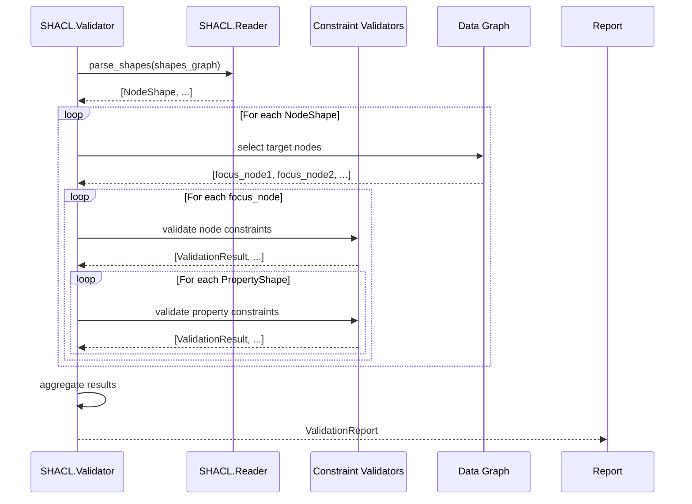
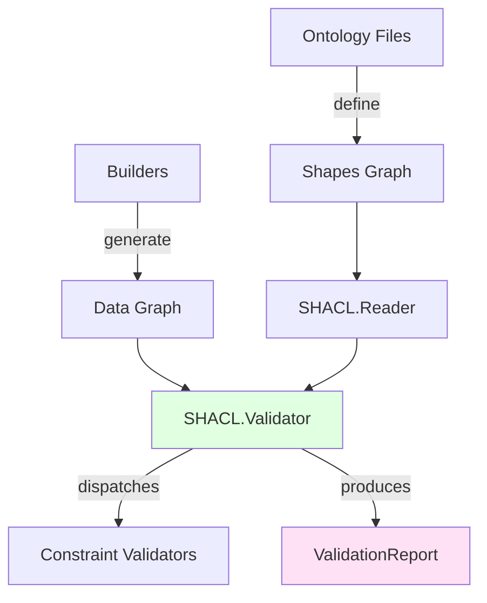

# Validators Component Guide

## Overview

The **Validators** layer provides SHACL (Shapes Constraint Language) validation for RDF graphs generated by the builders. It ensures that generated knowledge graphs conform to the ontology constraints defined in the Elixir ontologies.

**Location**: `lib/elixir_ontologies/shacl/` and `lib/elixir_ontologies/validator/`

## Purpose

Validators are responsible for:
- Parsing SHACL shapes from ontology files
- Selecting target nodes from data graphs
- Validating constraint compliance
- Generating validation reports
- Supporting parallel validation for performance

## Design Philosophy

Validators follow these principles:

1. **W3C Compliance** - Follow SHACL W3C Recommendation
2. **Closed-world validation** - Unlike OWL, SHACL validates for completeness
3. **Extensible constraints** - Easy to add new constraint validators
4. **Parallel execution** - Validate multiple shapes concurrently
5. **Clear reporting** - Detailed violation/warning/info messages

## Component Architecture

```mermaid
graph TD
    Data[Data Graph] --> Validator[SHACL.Validator]
    Shapes[Shapes Graph] --> Reader[SHACL.Reader]
    Reader --> Validator
    Validator --> Dispatch[Constraint Validators]

    Dispatch --> Cardinality[Cardinality]
    Dispatch --> Type[Type]
    Dispatch --> String[String]
    Dispatch --> Value[Value]
    Dispatch --> Qualified[Qualified]
    Dispatch --> Logical[LogicalOperators]
    Dispatch --> SPARQL[SPARQL]

    Validator --> Report[ValidationReport]
    Report --> Results[ValidationResults]

    style Validator fill:#e1ffe1
    style Dispatch fill:#fff4e1
    style Report fill:#ffe1f5
```



## Core Modules

### SHACL.Validator

Main orchestration engine that coordinates validation:

```elixir
# Run validation
{:ok, data_graph} = RDF.Turtle.read_file("my_data.ttl")
{:ok, shapes_graph} = RDF.Turtle.read_file("elixir-shapes.ttl")

{:ok, report} = SHACL.Validator.run(data_graph, shapes_graph)

if report.conforms? do
  IO.puts("Valid!")
else
  IO.puts("Found #{length(report.results)} violations")
end
```

**Key Functions**:
- `run/3` - Main validation entry point
- `validate_node_shape/3` - Validate a single shape against target nodes
- `validate_property_shape/3` - Validate property constraints

### SHACL.Reader

Parses SHACL shapes from RDF graphs into Elixir structs:

```elixir
{:ok, node_shapes} = SHACL.Reader.parse_shapes(shapes_graph)
```

**Key Functions**:
- `parse_shapes/1` - Extract all NodeShapes from graph
- `parse_property_shapes/2` - Extract PropertyShapes for a NodeShape

### SHACL.Model

Defines Elixir structs for SHACL concepts:

| Module | Purpose |
|--------|---------|
| **NodeShape** | Represents a sh:NodeShape with target and constraints |
| **PropertyShape** | Represents a sh:PropertyShape with path and constraints |
| **ValidationResult** | Single validation result (violation/warning/info) |
| **ValidationReport** | Aggregated report with conforms? flag |

### Validator.Report

High-level validation report structures for Elixir code:

| Module | Purpose |
|--------|---------|
| **Report** | Main report struct with conforms, violations, warnings |
| **Violation** | Constraint violation with focus node, message |
| **Warning** | Non-critical issue |
| **Info** | Informational message |

## Constraint Validators

### Cardinality Validator

Validates property count constraints:

```elixir
# sh:minCount constraint
sh:property [
    sh:path struct:arity ;
    sh:minCount 1 ;      # arity is required
    sh:maxCount 1        # arity is single-valued
]
```

**Validates**:
- `minCount` - Minimum number of values
- `maxCount` - Maximum number of values

### Type Validator

Validates datatype and class constraints:

```elixir
# sh:datatype constraint
sh:property [
    sh:path struct:arity ;
    sh:datatype xsd:nonNegativeInteger
]

# sh:class constraint
sh:property [
    sh:path struct:containsFunction ;
    sh:class struct:Function
]
```

**Validates**:
- `datatype` - XSD datatype compliance
- `class` - RDF class membership
- `nodeKind` - Literal/BlankNode/IRI constraints

### String Validator

Validates string-based constraints:

```elixir
sh:property [
    sh:path struct:functionName ;
    sh:pattern "^[a-z_][a-zA-Z0-9_]*$" ;
    sh:minLength 1
]
```

**Validates**:
- `pattern` - Regex pattern matching
- `minLength` - Minimum string length
- `maxLength` - Maximum string length

### Value Validator

Validates value constraints:

```elixir
sh:property [
    sh:path struct:visibility ;
    sh:in ("public" "private")
]
```

**Validates**:
- `in` - Value from enumeration
- `hasValue` - Specific required value
- `languageIn` - Allowed language tags

### Qualified Validator

Validates qualified value shape constraints:

```elixir
sh:property [
    sh:path struct:hasParameter ;
    sh:qualifiedValueShape [
        sh:property [
            sh:path struct:parameterName ;
            sh:pattern "^[a-z_]"
        ]
    ] ;
    sh:qualifiedMinCount 1
]
```

### Logical Operators Validator

Validates logical constraint combinations:

```elixir
# sh:and - all shapes must conform
sh:and (
    :Shape1
    :Shape2
)

# sh:or - at least one must conform
sh:or (
    :PublicFunction
    :PrivateFunction
)

# sh:xone - exactly one must conform
sh:xone (
    :Function
    :Macro
)

# sh:not - must NOT conform
sh:not :InvalidShape
```

### SPARQL Validator

Validates SPARQL-based constraints:

```elixir
sh:sparql """
    PREFIX struct: <https://w3id.org/elixir-code/structure#>

    SELECT $this ($module AS ?fail)
    WHERE {
        $this struct:definedInModule $module .
        FILTER NOT EXISTS { $module a struct:Module }
    }
"""
```

## Validation Workflow



## Validation Report Structure

```elixir
%ValidationReport{
  conforms?: false,
  results: [
    %ValidationResult{
      focus_node: ~I<http://example.org/MyModule>,
      result_severity: :violation,
      result_message: "Required property hasFunction is missing",
      source_shape: ~I<http://example.org/shapes#ModuleShape>,
      constraint_component: ~I<http://www.w3.org/ns/shacl#MinCountConstraintComponent>
    }
  ]
}
```

### Severity Levels

| Level | SHACL IRI | Usage |
|-------|-----------|-------|
| **Violation** | `sh:Violation` | Constraint failure (affects conformance) |
| **Warning** | `sh:Warning` | Non-critical issue |
| **Info** | `sh:Info` | Informational message |

## Usage Examples

### Basic Validation

```elixir
alias ElixirOntologies.SHACL.Validator

# Load graphs
data_graph = ElixirOntologies.analyze("lib/my_app")
{:ok, shapes_graph} = RDF.Turtle.read_file("priv/ontologies/elixir-shapes.ttl")

# Validate
{:ok, report} = Validator.run(data_graph, shapes_graph)

if report.conforms? do
  IO.puts("Graph conforms to shapes!")
else
  Enum.each(report.results, fn result ->
    IO.puts("[#{result.severity}] #{result.result_message}")
    IO.puts("  Focus node: #{result.focus_node}")
  end)
end
```

### Parallel Validation

```elixir
# Enable parallel validation (default)
{:ok, report} = Validator.run(data_graph, shapes_graph,
  parallel: true,
  max_concurrency: System.schedulers_online(),
  timeout: 10_000
)
```

### Custom Report Generation

```elixir
defmodule MyReporter do
  def print_report(%ValidationReport{} = report) do
    IO.puts("\n=== Validation Report ===")
    IO.puts("Conforms: #{report.conforms?}")
    IO.puts("Issues: #{length(report.results)}")

    Enum.group_by(report.results, & &1.severity)
    |> Enum.each(fn {severity, results} ->
      IO.puts("\n#{severity}: #{length(results)}")
      Enum.each(results, &print_result/1)
    end)
  end

  defp print_result(result) do
    IO.puts("  - #{result.result_message}")
    IO.puts("    Focus: #{result.focus_node}")
    if result.result_path do
      IO.puts("    Path: #{result.result_path}")
    end
  end
end
```

## Extension Points

### Adding a New Constraint Validator

1. **Create validator module** in `shacl/validators/`:

```elixir
defmodule ElixirOntologies.SHACL.Validators.Custom do
  @moduledoc """
  Custom constraint validator.
  """

  alias ElixirOntologies.SHACL.Model.{PropertyShape, ValidationResult}

  @doc """
  Validate a custom constraint on properties.
  """
  def validate(data_graph, focus_node, %PropertyShape{} = property_shape) do
    # Check if property has the custom constraint
    if has_custom_constraint?(property_shape) do
      # Perform validation logic
      if valid?(data_graph, focus_node, property_shape) do
        []
      else
        [
          %ValidationResult{
            focus_node: focus_node,
            result_severity: :violation,
            result_message: "Custom constraint violated",
            source_shape: property_shape.id
          }
        ]
      end
    else
      []
    end
  end

  defp has_custom_constraint?(property_shape) do
    # Check for custom constraint marker
    Map.has_key?(property_shape.constraints, :custom_constraint)
  end

  defp valid?(data_graph, focus_node, property_shape) do
    # Custom validation logic
    true
  end
end
```

2. **Register in main validator**:

```elixir
# In SHACL.Validator.validate_property_shape/3
defp validate_property_shape(data_graph, focus_node, property_shape) do
  []
  |> concat(Validators.Cardinality.validate(...))
  |> concat(Validators.Custom.validate(...))  # Add here
end
```

### Adding Custom Validation Results

```elixir
# Create custom result types
defmodule ElixirOntologies.Validator.CustomResult do
  defstruct [:focus_node, :message, :details]

  def to_validation_result(%__MODULE__{} = custom) do
  %ValidationResult{
    focus_node: custom.focus_node,
    result_severity: :warning,
    result_message: custom.message,
    source_constraint_component: ~I<http://example.org#CustomComponent>
  }
end
end
```

## Vocabulary Reference

The `SHACL.Vocabulary` module provides centralized IRI constants:

```elixir
alias ElixirOntologies.SHACL.Vocabulary, as: SHACL

# Core classes
SHACL.node_shape()         # => ~I<http://www.w3.org/ns/shacl#NodeShape>
SHACL.validation_report()  # => ~I<http://www.w3.org/ns/shacl#ValidationReport>

# Constraints
SHACL.min_count()          # => ~I<http://www.w3.org/ns/shacl#minCount>
SHACL.pattern()            # => ~I<http://www.w3.org/ns/shacl#pattern>
SHACL.datatype()           # => ~I<http://www.w3.org/ns/shacl#datatype>

# Report predicates
SHACL.conforms()           # => ~I<http://www.w3.org/ns/shacl#conforms>
SHACL.focus_node()         # => ~I<http://www.w3.org/ns/shacl#focusNode>
SHACL.result_message()     # => ~I<http://www.w3.org/ns/shacl#resultMessage>

# Severity
SHACL.violation()          # => ~I<http://www.w3.org/ns/shacl#Violation>
SHACL.warning()            # => ~I<http://www.w3.org/ns/shacl#Warning>
SHACL.info()               # => ~I<http://www.w3.org/ns/shacl#Info>
```

## Testing Validators

### Unit Tests

```elixir
defmodule ElixirOntologies.SHACL.Validators.StringTest do
  use ExUnit.Case
  alias ElixirOntologies.SHACL.Validators.String

  test "validates pattern constraint" do
    data_graph = RDF.Graph.new([
      {~I<http://example.org/n1>, ~I<http://example.org#name>, RDF.literal("invalid_Name")}
    ])

    property_shape = %PropertyShape{
      path: ~I<http://example.org#name>,
      pattern: ~r/^[a-z][a-zA-Z0-9]*$/
    }

    results = String.validate(data_graph, ~I<http://example.org/n1>, property_shape)

    assert length(results) == 1
    assert hd(results).result_severity == :violation
  end
end
```

### Integration Tests

```elixir
defmodule ElixirOntologies.ValidationTest do
  use ExUnit.Case
  alias ElixirOntologies.SHACL.Validator

  test "full validation pipeline" do
    # Build test data
    data_graph = build_test_graph()

    # Load shapes
    {:ok, shapes_graph} = RDF.Turtle.read_file("priv/ontologies/elixir-shapes.ttl")

    # Run validation
    {:ok, report} = Validator.run(data_graph, shapes_graph)

    # Assert results
    assert report.conforms? == expected_conformance()
  end
end
```

## Performance Considerations

### Parallel Validation

By default, validation runs in parallel with one task per scheduler:

```elixir
# Default: parallel validation
Validator.run(data_graph, shapes_graph)

# Adjust concurrency
Validator.run(data_graph, shapes_graph,
  max_concurrency: 4,
  timeout: 30_000
)
```

### Target Node Selection

The validator uses graph traversal to find target nodes:

```elixir
# Via sh:targetClass
sh:targetClass struct:Module  # All Module instances

# Via sh:targetNode (direct)
sh:targetNode <#specific_node>

# Via implicit class targeting
shape also a rdfs:Class  # All instances of the class
```

## Relationships



## Key Functions Reference

### SHACL.Validator

| Function | Purpose |
|----------|---------|
| `run/3` | Main validation entry point |
| `validate_node_shape/3` | Validate a single NodeShape |
| `validate_property_shape/3` | Validate property constraints |

### SHACL.Reader

| Function | Purpose |
|----------|---------|
| `parse_shapes/1` | Extract NodeShapes from graph |
| `parse_property_shapes/2` | Extract PropertyShapes for NodeShape |

### Validator.Report

| Function | Purpose |
|----------|---------|
| `new/0` | Create empty conformant report |
| `new/1` | Create report with attributes |
| `has_violations?/1` | Check if report has violations |

## Related Components

- **[Builders Component](builders.md)** - Generates data to validate
- **[SHACL Component](shacl.md)** - SHACL model and writing
- **[Architecture Overview](../architecture.md)** - System architecture

## References

- [Validator Module](../../../lib/elixir_ontologies/shacl/validator.ex)
- [Reader Module](../../../lib/elixir_ontologies/shacl/reader.ex)
- [Model Modules](../../../lib/elixir_ontologies/shacl/model/)
- [Validator Report](../../../lib/elixir_ontologies/validator/report.ex)
- [SHACL Specification](https://www.w3.org/TR/shacl/)
