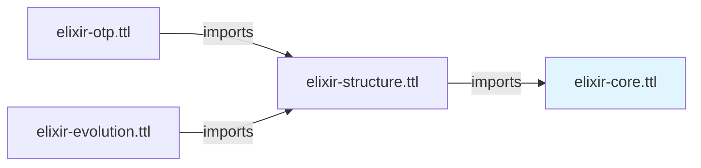

# Elixir Core Ontology

## Overview

The **Elixir Core Ontology** (`elixir-core.ttl`) provides the foundational classes and properties for representing Elixir source code structures. It defines base AST primitives, data types, and language-agnostic code constructs, aligned with established upper ontologies (BFO and IAO) for semantic rigor.

**IRI**: `https://w3id.org/elixir-code/core`
**Size**: ~44 KB
**Dependencies**: None (base layer)
**Version**: 1.0.0

## Purpose

The Core Ontology serves as the foundation for all other Elixir ontologies. It provides:

1. **Foundational code abstractions** aligned with BFO (Basic Formal Ontology)
2. **AST node types** representing parsed Elixir code structure
3. **Literal types** for all Elixir data values
4. **Operator expressions** for arithmetic, comparison, and logical operations
5. **Pattern matching constructs** for Elixir's pattern matching semantics
6. **Control flow expressions** for conditionals, loops, and try/catch
7. **Call expressions** for function invocation
8. **External alignments** to BFO, IAO, and PROV-O

## Relationship to Other Ontologies



- **elixir-structure.ttl** imports Core to build Elixir-specific constructs (Module, Function, Protocol)
- **elixir-otp.ttl** imports Structure, which imports Core
- **elixir-evolution.ttl** imports Structure, which imports Core
- **elixir-shapes.ttl** validates all layers including Core

## Class Hierarchy

### Foundational Classes (BFO/IAO Aligned)

| Class | Description | BFO Alignment |
|-------|-------------|---------------|
| **CodeElement** | Abstract base for all code constructs | `bfo:BFO_0000031` (GDC) |
| **SourceLocation** | File path and position information | `bfo:BFO_0000006` (Spatial Region) |
| **SourceFile** | Physical .ex or .exs file | `bfo:BFO_0000030` (Object) |
| **Repository** | Version control repository | `bfo:BFO_0000031` (GDC) |
| **CommitRef** | Git commit SHA, tag, or branch | `bfo:BFO_0000031` (GDC) |

### AST Node Classes

```
ASTNode
├── Expression (evaluable, produces value)
│   ├── Literal (constant values)
│   ├── OperatorExpression (unary/binary operators)
│   ├── Variable (named references)
│   ├── ControlFlowExpression (if, case, cond, etc.)
│   ├── CallExpression (function invocation)
│   └── Pattern (pattern matching)
├── Statement (side-effecting actions)
└── Declaration (named entity introductions)
```

### Literal Type Hierarchy

```
Literal
├── AtomLiteral
│   ├── BooleanLiteral (true, false)
│   └── NilLiteral (nil)
├── IntegerLiteral
├── FloatLiteral
├── StringLiteral
├── CharlistLiteral
├── BinaryLiteral
├── ListLiteral
├── TupleLiteral
├── MapLiteral
│   └── StructLiteral
├── KeywordListLiteral
├── SigilLiteral
└── RangeLiteral
```

### Operator Classes

| Category | Operators |
|----------|-----------|
| **ArithmeticOperator** | `+`, `-`, `*`, `/`, `++`, `--`, `<>`, `+++` |
| **ComparisonOperator** | `==`, `!=`, `===`, `!==`, `<`, `>`, `<=`, `>=` |
| **LogicalOperator** | `and`, `or`, `not` |
| **UnaryOperator** | `+`, `-`, `!`, `~~~`, `@` |
| **BinaryOperator** | All arithmetic, comparison, and logical operators |
| **PipeOperator** | `|>` (forward pipe) |
| **MatchOperator** | `=` (pattern match) |
| **CaptureOperator** | `&` (function capture) |
| **InOperator** | `in` (membership test) |

### Control Flow Expressions

| Class | Description |
|-------|-------------|
| **IfExpression** | Conditional branching (`if/else`) |
| **UnlessExpression** | Negated conditional (`unless/else`) |
| **CaseExpression** | Pattern matching on values |
| **CondExpression** | Multiple condition testing |
| **WithExpression** | Comprehension-style chaining |
| **TryExpression** | Exception handling (`try/rescue/catch/after/else`) |
| **ReceiveExpression** | Message pattern matching |
| **ForExpression** | List comprehensions (deprecated in Elixir) |
| **RaiseExpression** | Exception raising |
| **ThrowExpression** | Non-local return |

### Pattern Classes

```
Pattern
├── LiteralPattern (constant value matching)
├── VariablePattern (variable binding)
├── WildcardPattern (underscore, matches anything)
├── PinPattern (value comparison via ^)
├── AsPattern (alias via @)
├── TuplePattern
├── ListPattern
├── MapPattern
├── StructPattern
└── BinaryPattern
```

### Call Expression Classes

| Class | Description |
|-------|-------------|
| **LocalCall** | Function call in current module (`foo()`) |
| **RemoteCall** | Function call in another module (`Module.foo()`) |
| **AnonymousFunctionCall** | Invocation via variable (`fun.()`) |
| **ModuleReference** | Standalone module alias (`MyApp.Module`) |
| **FunctionReference** | Captured function reference (`&Module.foo/arity`) |

## Key Properties

### Literal Value Properties

| Property | Domain | Range | Description |
|----------|--------|-------|-------------|
| **atomValue** | AtomLiteral | xsd:string | The atom name (without `:` prefix) |
| **integerValue** | IntegerLiteral | xsd:integer | Integer value |
| **floatValue** | FloatLiteral | xsd:double | Floating-point value |
| **stringValue** | StringLiteral | xsd:string | String content |
| **booleanValue** | BooleanLiteral | xsd:boolean | `true` or `false` |

### Operator Properties

| Property | Domain | Range | Description |
|----------|--------|-------|-------------|
| **operatorSymbol** | OperatorExpression | xsd:string | The operator character(s) |
| **hasLeftOperand** | BinaryOperator | Expression | Left side of binary operator |
| **hasRightOperand** | BinaryOperator | Expression | Right side of binary operator |
| **hasOperand** | UnaryOperator | Expression | Single operand |

### Control Flow Properties

| Property | Domain | Range | Description |
|----------|--------|-------|-------------|
| **hasCondition** | IfExpression, UnlessExpression, CondExpression | Expression | Boolean condition to test |
| **hasThenBranch** | IfExpression, UnlessExpression | Expression | Expression if condition true |
| **hasElseBranch** | IfExpression, UnlessExpression | Expression | Expression if condition false |
| **hasClause** | CaseExpression, CondExpression, ReceiveExpression | rdf:List | Ordered clauses (RDF list) |
| **hasTryBody** | TryExpression | Expression | Protected code block |
| **hasRescueClause** | TryExpression | rdf:List | Rescue clauses (RDF list) |
| **hasCatchClause** | TryExpression | rdf:List | Catch clauses (RDF list) |
| **hasAfterBlock** | TryExpression | Expression | Cleanup block |

### Call Expression Properties

| Property | Domain | Range | Description |
|----------|--------|-------|-------------|
| **functionName** | LocalCall, RemoteCall | xsd:string | Function name as string |
| **moduleName** | RemoteCall, ModuleReference | xsd:string | Module name as string |
| **arity** | CallExpression, FunctionReference | xsd:integer | Number of parameters |
| **hasArgument** | CallExpression | Expression | Function argument (ordered via RDF list) |
| **refersToFunction** | LocalCall, RemoteCall | Function | IRI of target function |
| **refersToModule** | RemoteCall, ModuleReference | Module | IRI of target module |

### Pattern Properties

| Property | Domain | Range | Description |
|----------|--------|-------|-------------|
| **hasExceptionPattern** | RescueClause | Pattern | Exception pattern to match |
| **refersToExceptionType** | RescueClause | Module | IRI of exception module |
| **hasCatchPattern** | CatchClause | Pattern | Value pattern to catch |
| **catchType** | CatchClause | xsd:string | `:throw`, `:error`, or `:exit` |

## Design Patterns

### 1. Composite Key Identity

Functions use `(Module, Name, Arity)` as composite key (defined in Structure layer, using Core types):

```turtle
:Function a owl:Class ;
    owl:hasKey (:definedInModule :functionName :arity) .
```

### 2. RDF Lists for Ordering

Clauses in control flow expressions use RDF lists to preserve evaluation order:

```turtle
:hasClause a owl:ObjectProperty ;
    rdfs:range [
        a owl:Class ;
        owl:unionOf (rdf:List owl:Thing)
    ] .
```

Example:
```turtle
<#case_expr> :hasClause [
    rdf:first <#clause/0> ;
    rdf:rest [
        rdf:first <#clause/1> ;
        rdf:rest rdf:nil
    ]
] .
```

### 3. Functional Properties

Properties like `arity` are functional (single value):

```turtle
:arity a owl:DatatypeProperty ;
    a owl:FunctionalProperty ;
    rdfs:domain :Function ;
    rdfs:range xsd:integer .
```

### 4. Disjoint Classes

Mutually exclusive expression types are declared disjoint:

```turtle
:IfExpression owl:disjointWith :UnlessExpression,
    :CaseExpression,
    :CondExpression,
    :WithExpression,
    :TryExpression .
```

## Example Usage

### Representing a Literal

```turtle
<#expr/0> a :IntegerLiteral ;
    :integerValue 42 .
```

### Representing a Binary Operation

```turtle
<#expr/1> a :ArithmeticOperator ;
    :operatorSymbol "+" ;
    :hasLeftOperand <#expr/0> ;  # 42
    :hasRightOperand <#expr/2> .  # 10

<#expr/0> a :IntegerLiteral ; :integerValue 42 .
<#expr/2> a :IntegerLiteral ; :integerValue 10 .
```

### Representing an If Expression

```turtle
<#expr/3> a :IfExpression ;
    :hasCondition <#expr/4> ;
    :hasThenBranch <#expr/5> ;
    :hasElseBranch <#expr/6> .

<#expr/4> a :Variable ; :name "is_logged_in" .
```

### Representing a Try Expression

```turtle
<#expr/7> a :TryExpression ;
    :hasTryBody <#expr/8> ;
    :hasRescueClause [
        rdf:first <#rescue/0> ;
        rdf:rest rdf:nil
    ] ;
    :hasAfterBlock <#expr/9> .

<#rescue/0> a :RescueClause ;
    :hasExceptionPattern <#pattern/0> ;
    :hasRescueBody <#expr/10> .
```

## SPARQL Query Examples

### Find All Arithmetic Operations

```sparql
PREFIX core: <https://w3id.org/elixir-code/core#>

SELECT ?expr ?op ?left_val ?right_val WHERE {
  ?expr a core:ArithmeticOperator ;
         core:operatorSymbol ?op ;
         core:hasLeftOperand ?left ;
         core:hasRightOperand ?right .

  ?left core:integerValue ?left_val .
  ?right core:integerValue ?right_val .
}
```

### Find All Rescue Clauses

```sparql
PREFIX core: <https://w3id.org/elixir-code/core#>

SELECT ?try ?pattern_type ?exception_module WHERE {
  ?try a core:TryExpression ;
       core:hasRescueClause ?list .

  ?list rdf:first/rdf:rest* ?clause .
  ?clause a core:RescueClause ;
          core:hasExceptionPattern ?pattern .

  ?pattern a ?pattern_type .
  OPTIONAL { ?clause core:refersToExceptionType ?exception_module . }
}
```

## External Alignments

### BFO (Basic Formal Ontology)

| Core Class | BFO Class | Rationale |
|------------|-----------|-----------|
| CodeElement | `BFO_0000031` | Generically dependent continuant |
| SourceLocation | `BFO_0000006` | Spatial region |
| SourceFile | `BFO_0000030` | Object (physical carrier) |

### IAO (Information Artifact Ontology)

| Core Class | IAO Class | Rationale |
|------------|-----------|-----------|
| ASTNode | `IAO_0000030` | Information content entity |
| Declaration | `IAO_0000030` | Directive/specification |

### PROV-O (Provenance Ontology)

| Core Class | PROV-O Class | Rationale |
|------------|-------------|-----------|
| Repository | `prov:Entity` | Versioned artifact |
| CommitRef | `prov:Entity` | Point-in-time reference |

## Related Ontologies

- **[Structure Ontology](structure.md)** - Builds on Core for Elixir modules and functions
- **[Shapes Ontology](shapes.md)** - Defines validation constraints for Core classes

## References

- [Elixir AST Format](https://hexdocs.pm/elixir/Quote.html)
- [BFO Specification](https://basic-form-ontology.org/)
- [IAO Specification](https://github.com/information-artifact-ontology/IAO)
- [OWL 2 Specification](https://www.w3.org/TR/owl2-overview/)
