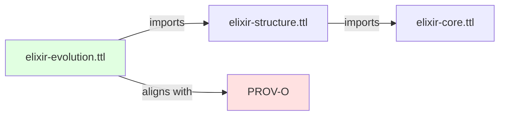
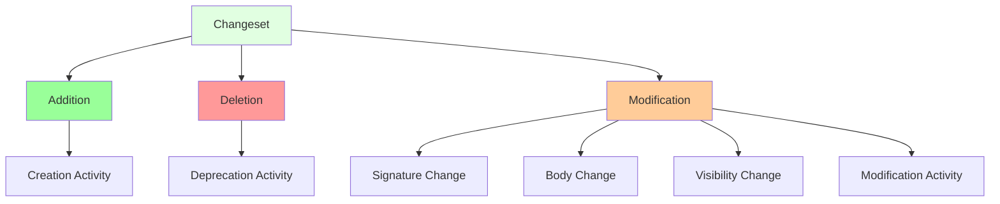

# Elixir Evolution Ontology

## Overview

The **Elixir Evolution Ontology** (`elixir-evolution.ttl`) provides provenance tracking and version management for Elixir code entities. It extends the Structure ontology with PROV-O (W3C Provenance Ontology) integration, enabling temporal queries across code versions and automated change detection between commits.

**IRI**: `https://w3id.org/elixir-code/evolution`
**Size**: ~28 KB
**Dependencies**: `elixir-structure.ttl` (imports)
**Version**: 1.0.0

## Purpose

The Evolution Ontology provides:

1. **Version tracking** - Named graphs for each codebase version
2. **Change detection** - Additions, deletions, modifications between versions
3. **Activity classification** - Creation, modification, refactoring, deprecation
4. **Provenance metadata** - Author, timestamp, commit message
5. **Changeset modeling** - Structured representation of code changes
6. **Temporal queries** - SPARQL queries across time periods

## Relationship to Other Ontologies



**Imports**: `elixir-structure.ttl` (which imports `elixir-core.ttl`)

**Alignment**: Uses PROV-O (`http://www.w3.org/ns/prov#`) for provenance modeling

## Class Hierarchy

```
Entity (from Structure)
├── Version
│   ├── hasVersionIRI
│   ├── hasVersionNumber
│   ├── hasCommitSHA
│   ├── hasTimestamp
│   └── hasActivity
├── Entity
│   ├── existsInVersion
│   ├── hasCreationActivity
│   ├── hasModificationActivity
│   └── hasDeprecationActivity
├── Changeset
│   ├── hasSourceVersion
│   ├── hasTargetVersion
│   ├── hasAddition
│   ├── hasDeletion
│   └── hasModification
└── Activity (from PROV-O)
    ├── Creation
    ├── Modification
    ├── Refactoring
    └── Deprecation
```

## Key Classes

### Version

Represents a specific version of the codebase (typically a git commit or tag).

| Property | Domain | Range | Description |
|----------|--------|-------|-------------|
| **hasVersionIRI** | Version | xsd:anyURI | Version identifier (named graph IRI) |
| **hasVersionNumber** | Version | xsd:string | Semantic version (e.g., "1.0.0") |
| **hasCommitSHA** | Version | xsd:string | Git commit SHA |
| **hasTimestamp** | Version | xsd:dateTime | Commit timestamp |
| **hasCommitMessage** | Version | xsd:string | Commit message |
| **hasAuthor** | Version | xsd:string | Commit author |
| **hasActivity** | Version | Activity | Activities in this version |

**Example**:
```turtle
<#version/v1.0.0> a :Version ;
    :hasVersionNumber "1.0.0" ;
    :hasCommitSHA "a1b2c3d..." ;
    :hasTimestamp "2025-01-01T00:00:00Z"^^xsd:dateTime ;
    :hasAuthor "developer@example.com" .
```

### Entity

Represents a code element (Module, Function, etc.) with version tracking.

| Property | Domain | Range | Description |
|----------|--------|-------|-------------|
| **existsInVersion** | Entity | Version | Version where entity exists |
| **hasCreationActivity** | Entity | Activity | Activity that created entity |
| **hasModificationActivity** | Entity | Activity | Activity that modified entity |
| **hasDeprecationActivity** | Entity | Activity | Activity that deprecated entity |
| **replacedBy** | Entity | Entity | Replacement entity (if renamed) |

### Changeset

Represents a set of changes between two versions.

| Property | Domain | Range | Description |
|----------|--------|-------|-------------|
| **hasSourceVersion** | Changeset | Version | Source version (before) |
| **hasTargetVersion** | Changeset | Version | Target version (after) |
| **hasAddition** | Changeset | Addition | Entities added |
| **hasDeletion** | Changeset | Deletion | Entities deleted |
| **hasModification** | Changeset | Modification | Entities modified |

### Activity

PROV-O aligned activity representing a code change action.

#### Subclasses

| Class | Description |
|-------|-------------|
| **Creation** | Entity was created |
| **Modification** | Entity was modified (signature, body) |
| **Refactoring** | Entity was refactored (internal changes) |
| **Deprecation** | Entity was marked deprecated |

| Property | Domain | Range | Description |
|----------|--------|-------|-------------|
| **used** | Activity | Entity | Entity that was acted upon |
| **generated** | Activity | Entity | Entity that resulted |
| **startedAtTime** | Activity | xsd:dateTime | Activity start time |
| **endedAtTime** | Activity | xsd:dateTime | Activity end time |
| **wasAssociatedWith** | Activity | Agent | Author/agent |
| **hadPlan** | Activity | Plan | Commit message/description |

### Addition

Represents an entity added in a changeset.

| Property | Domain | Range | Description |
|----------|--------|-------|-------------|
| **addedEntity** | Addition | Entity | The entity that was added |
| **addedInVersion** | Addition | Version | Version where added |

### Deletion

Represents an entity removed in a changeset.

| Property | Domain | Range | Description |
|----------|--------|-------|-------------|
| **deletedEntity** | Deletion | Entity | The entity that was deleted |
| **deletedInVersion** | Deletion | Version | Version where deleted |

### Modification

Represents an entity modified in a changeset.

| Property | Domain | Range | Description |
|----------|--------|-------|-------------|
| **modifiedEntity** | Modification | Entity | The entity that was modified |
| **modifiedInVersion** | Modification | Version | Version where modified |
| **hasChangeType** | Modification | xsd:string | Type of modification |
| **hasPreviousState** | Modification | Entity | State before modification |
| **hasNewState** | Modification | Entity | State after modification |

## Change Classification



### Modification Types

| Type | Description | Example |
|------|-------------|---------|
| **signature-change** | Function signature changed | Arity changed, parameters renamed |
| **body-change** | Function body modified | Implementation changed |
| **visibility-change** | Public/private changed | `defp` to `def` or vice versa |
| **type-change** | Type specification changed | Typespec updated |
| **doc-change** | Documentation updated | `@doc` changed |
| **attribute-change** | Module attribute changed | `@moduledoc`, `@spec` changed |
| **refactoring** | Internal refactoring | No external API change |
| **rename** | Entity renamed | Function/module renamed |

## Named Graphs for Versioning

Each version of the codebase is stored in a separate named graph:

```turtle
# Version 1.0.0
<#graph/v1.0.0> {
    <#module/StringIO> a :Module ;
        :moduleName "StringIO" ;
        :definesFunction <#func/StringIO.flush/1> .
}

# Version 1.1.0
<#graph/v1.1.0> {
    <#module/StringIO> a :Module ;
        :moduleName "StringIO" ;
        :definesFunction <#func/StringIO.flush/1> ;
        :definesFunction <#func/StringIO.flush/2> .
}
```

## RDF-star for Statement-Level Provenance

RDF-star allows attaching provenance directly to triples:

```turtle
<#func/StringIO.flush/1> :hasBody <#expr/body>
    |> prov:wasGeneratedBy <#activity/commit-abc> .
```

This indicates that the specific triple about the function's body was generated by a specific commit.

## SPARQL Query Examples

### Find All Functions Added in a Version

```sparql
PREFIX evo: <https://w3id.org/elixir-code/evolution#>
PREFIX struct: <https://w3id.org/elixir-code/structure#>

SELECT ?func ?module WHERE {
  GRAPH ?version {
    ?func a struct:Function ;
         struct:definedInModule ?module .
  }

  ?version evo:hasVersionNumber "1.1.0" .
  MINUS {
    ?func evo:existsInVersion ?previous .
    ?previous evo:hasVersionNumber "1.0.0" .
  }
}
```

### Find Function Modifications Between Versions

```sparql
PREFIX evo: <https://w3id.org/elixir-code/evolution#>
PREFIX struct: <https://w3id.org/elixir-code/structure#>

SELECT ?func ?change_type WHERE {
  ?changeset a evo:Changeset ;
             evo:hasSourceVersion ?v1 ;
             evo:hasTargetVersion ?v2 ;
             evo:hasModification ?mod .

  ?v1 evo:hasVersionNumber "1.0.0" .
  ?v2 evo:hasVersionNumber "1.1.0" .

  ?mod evo:modifiedEntity ?func ;
       evo:hasChangeType ?change_type .

  ?func a struct:Function .
}
```

### Find Deprecated Functions

```sparql
PREFIX evo: <https://w3id.org/elixir-code/evolution#>
PREFIX struct: <https://w3id.org/elixir-code/structure#>

SELECT ?func ?module ?deprecation_version WHERE {
  ?func a struct:Function ;
        evo:hasDeprecationActivity ?activity ;
        struct:definedInModule ?module .

  ?activity evo:occurredInVersion ?deprecation_version .
}
```

### Track Entity History

```sparql
PREFIX evo: <https://w3id.org/elixir-code/evolution#>
PREFIX prov: <http://www.w3.org/ns/prov#>

SELECT ?version ?timestamp ?activity_type WHERE {
  ?entity evo:existsInVersion ?version .
  ?version evo:hasTimestamp ?timestamp .

  OPTIONAL {
    ?entity prov:wasGeneratedBy ?activity .
    ?activity a ?activity_type .
  }
}
ORDER BY ?timestamp
```

## Temporal Query Patterns

### Changes in Time Range

```sparql
PREFIX evo: <https://w3id.org/elixir-code/evolution#>

SELECT ?changeset ?source ?target WHERE {
  ?changeset a evo:Changeset ;
             evo:hasTargetVersion ?version .

  ?version evo:hasTimestamp ?ts .
  FILTER (?ts >= "2025-01-01T00:00:00Z"^^xsd:dateTime &&
          ?ts <= "2025-12-31T23:59:59Z"^^xsd:dateTime)
}
```

### Evolution of a Specific Function

```sparql
PREFIX evo: <https://w3id.org/elixir-code/evolution#>
PREFIX struct: <https://w3id.org/elixir-code/structure#>

SELECT ?version ?timestamp ?spec_exists WHERE {
  ?func struct:functionName "format_data" ;
        struct:arity 2 .

  {
    SELECT ?version ?timestamp WHERE {
      ?func evo:existsInVersion ?version .
      ?version evo:hasTimestamp ?timestamp .
    }
  } UNION {
    SELECT ?version ?timestamp WHERE {
      GRAPH ?version {
        ?func a struct:Function .
      }
      ?version evo:hasTimestamp ?timestamp .
    }
  }

  OPTIONAL {
    ?func struct:hasSpec ?spec .
    BIND(BOUND(?spec) AS ?spec_exists)
  }
}
ORDER BY ?timestamp
```

## Example: Complete Version Tracking

```turtle
# Version 1.0.0
<#version/v1.0.0> a :Version ;
    :hasVersionNumber "1.0.0" ;
    :hasCommitSHA "abc123" ;
    :hasTimestamp "2025-01-01T00:00:00Z"^^xsd:dateTime ;
    :hasAuthor "alice@example.com" ;
    :hasActivity <#activity/init> .

<#activity/init> a :Creation ;
    prov:startedAtTime "2025-01-01T00:00:00Z"^^xsd:dateTime ;
    prov:endedAtTime "2025-01-01T00:00:05Z"^^xsd:dateTime ;
    prov:wasAssociatedWith "alice@example.com" ;
    prov:hadPlan "Initial commit" .

# Named graph for version 1.0.0
<#graph/v1.0.0> {
    <#module/User> a struct:Module ;
        struct:moduleName "User" ;
        struct:definesFunction <#func/User.new/1> .

    <#func/User.new/1> a struct:Function ;
        struct:functionName "new" ;
        struct:arity 1 .
}

# Version 1.1.0
<#version/v1.1.0> a :Version ;
    :hasVersionNumber "1.1.0" ;
    :hasCommitSHA "def456" ;
    :hasTimestamp "2025-01-15T00:00:00Z"^^xsd:dateTime ;
    :hasAuthor "bob@example.com" ;
    :hasActivity <#activity/add_func> .

<#activity/add_func> a :Creation ;
    prov:startedAtTime "2025-01-15T00:00:00Z"^^xsd:dateTime ;
    prov:wasAssociatedWith "bob@example.com" ;
    prov:used <#module/User> ;
    prov:generated <#func/User.changeset/2> .

# Changeset between 1.0.0 and 1.1.0
<#changeset/v1.0.0-v1.1.0> a :Changeset ;
    :hasSourceVersion <#version/v1.0.0> ;
    :hasTargetVersion <#version/v1.1.0> ;
    :hasAddition <#add/User.changeset/2> .

<#add/User.changeset/2> a :Addition ;
    :addedEntity <#func/User.changeset/2> ;
    :addedInVersion <#version/v1.1.0> .

# Named graph for version 1.1.0
<#graph/v1.1.0> {
    <#module/User> a struct:Module ;
        struct:moduleName "User" ;
        struct:definesFunction <#func/User.new/1> ;
        struct:definesFunction <#func/User.changeset/2> .

    <#func/User.changeset/2> a struct:Function ;
        struct:functionName "changeset" ;
        struct:arity 2 .
}
```

## Integration with Git

The Evolution ontology is designed to work with git repositories:

| Git Concept | Ontology Mapping |
|-------------|------------------|
| **Commit SHA** | `Version.hasCommitSHA` |
| **Commit timestamp** | `Version.hasTimestamp` |
| **Commit author** | `Version.hasAuthor` |
| **Commit message** | `Activity.hadPlan` |
| **Diff (additions)** | `Addition.addedEntity` |
| **Diff (deletions)** | `Deletion.deletedEntity` |
| **Diff (modifications)** | `Modification.modifiedEntity` |

## Configuration

```elixir
# Config for evolution tracking
config = ElixirOntologies.Config.new(
  include_git_info: true,  # Include git provenance
  history_depth: :tags_only,  # Only track tagged versions
  max_versions: 100  # Limit number of versions stored
)
```

## Related Ontologies

- **[Structure Ontology](structure.md)** - Base for Module and Function
- **[Core Ontology](core.md)** - Foundation for code elements
- **PROV-O** - W3C Provenance Ontology (external)

## References

- [PROV-O Specification](https://www.w3.org/TR/prov-o/)
- [RDF-star Draft](https://w3c.github.io/rdf-star/)
- [Git Provenance](https://git-scm.com/docs/git-provenance)
