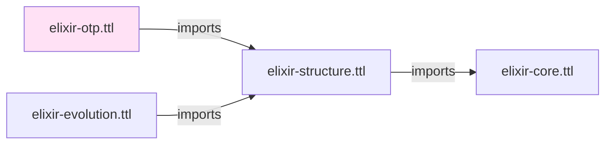
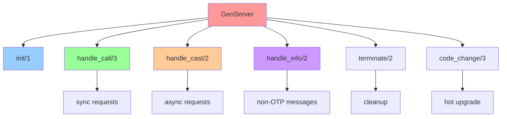

# Elixir OTP Ontology

## Overview

The **Elixir OTP Ontology** (`elixir-otp.ttl`) models Open Telecom Platform (OTP) design patterns and runtime behaviors. It provides classes and properties for representing GenServers, Supervisors, Agents, Tasks, ETS tables, and application supervision trees that form the foundation of reliable, fault-tolerant Elixir systems.

**IRI**: `https://w3id.org/elixir-code/otp`
**Size**: ~30 KB
**Dependencies**: `elixir-structure.ttl` (imports)
**Version**: 1.0.0

## Purpose

The OTP Ontology provides:

1. **GenServer modeling** - Callbacks, state management, handle_* clauses
2. **Supervisor trees** - Restart strategies, child specifications
3. **Agent representations** - State encapsulation patterns
4. **Task modeling** - Async computation and supervision
5. **ETS tables** - In-memory storage with access patterns
6. **Application organization** - Supervision tree hierarchy
7. **OTP patterns** - start_link, init, terminate, child specs

## Relationship to Other Ontologies



**Imports**: `elixir-structure.ttl` (which imports `elixir-core.ttl`)

**Imported by**: None (leaf layer in structural hierarchy)

## Class Hierarchy

```
Module (from Structure)
├── GenServer
│   ├── InitClause (init/1 callback)
│   ├── HandleCallClause (handle_call/3)
│   ├── HandleCastClause (handle_cast/2)
│   ├── HandleInfoClause (handle_info/2)
│   ├── HandleContinueClause (handle_continue/2)
│   ├── TerminateClause (terminate/2)
│   ├── CodeChangeClause (code_change/3)
│   └── ChildSpec (child specification)
├── Supervisor
│   ├── RestartStrategy
│   ├── ChildSpecification
│   │   ├── ChildID
│   │   ├── StartModule
│   │   ├── StartFunction
│   │   ├── RestartType
│   │   ├── ShutdownType
│   │   └── Type
│   └── SupervisorStrategy
│       ├── OneForOne
│       ├── OneForAll
│       ├── RestForOne
│       └── SimpleOneForOne
├── Agent
│   └── StateFunction
├── Task
│   └── TaskSpec
└── ETS
    ├── Table
    ├── TableType
    ├── AccessType
    └── TableOptions
```

## Key Classes

### GenServer

Represents a Generic Server process - OTP's standard behavior for encapsulating state and handling synchronous/asynchronous calls.

| Property | Domain | Range | Description |
|----------|--------|-------|-------------|
| **hasInitClause** | GenServer | InitClause | `init/1` callback |
| **hasHandleCallClause** | GenServer | rdf:List | `handle_call/3` clauses |
| **hasHandleCastClause** | GenServer | rdf:List | `handle_cast/2` clauses |
| **hasHandleInfoClause** | GenServer | rdf:List | `handle_info/2` clauses |
| **hasHandleContinueClause** | GenServer | rdf:List | `handle_continue/2` clauses |
| **hasTerminateClause** | GenServer | TerminateClause | `terminate/2` callback |
| **hasCodeChangeClause** | GenServer | CodeChangeClause | `code_change/3` callback |
| **hasChildSpec** | GenServer | ChildSpec | Child specification for supervisors |

**Example**:
```turtle
<#module/MyServer> a otp:GenServer ;
    struct:moduleName "MyServer" ;
    otp:hasInitClause <#init/0> ;
    otp:hasHandleCallClause [
        rdf:first <#handle_call/get_state/3> ;
        rdf:rest rdf:nil
    ] .
```

### InitClause

Represents the `init/1` callback that initializes server state.

| Property | Domain | Range | Description |
|----------|--------|-------|-------------|
| **hasInitialState** | InitClause | Expression | Initial state expression |
| **hasInitOptions** | InitClause | Expression | Init argument processing |

### HandleCallClause

Represents `handle_call/3` for synchronous requests.

| Property | Domain | Range | Description |
|----------|--------|-------|-------------|
| **handlesMessage** | HandleCallClause | xsd:string | Message pattern (`:get_state`, etc.) |
| **hasFromPattern** | HandleCallClause | Pattern | `{from, tag}` pattern |
| **hasStatePattern** | HandleCallClause | Pattern | State pattern matching |
| **hasReply** | HandleCallClause | Expression | `{:reply, response, state}` tuple |
| **hasNoreply** | HandleCallClause | Expression | `{:noreply, state}` tuple |

### HandleCastClause

Represents `handle_cast/2` for asynchronous requests.

| Property | Domain | Range | Description |
|----------|--------|-------|-------------|
| **handlesMessage** | HandleCastClause | xsd:string | Message pattern |
| **hasStatePattern** | HandleCastClause | Pattern | State pattern matching |
| **hasReply** | HandleCastClause | Expression | Response tuple |

### HandleInfoClause

Represents `handle_info/2` for non-OTP messages.

| Property | Domain | Range | Description |
|----------|--------|-------|-------------|
| **handlesMessage** | HandleInfoClause | xsd:string | Message type (`:DOWN`, `:EXIT`) |
| **hasStatePattern** | HandleInfoClause | Pattern | State pattern matching |
| **hasReply** | HandleInfoClause | Expression | Response tuple |

### TerminateClause

Represents `terminate/2` cleanup callback.

| Property | Domain | Range | Description |
|----------|--------|-------|-------------|
| **hasReasonPattern** | TerminateClause | Pattern | Shutdown reason pattern |
| **hasStatePattern** | TerminateClause | Pattern | State pattern matching |
| **hasCleanupBody** | TerminateClause | Expression | Cleanup code |

### CodeChangeClause

Represents `code_change/3` for hot code upgrades.

| Property | Domain | Range | Description |
|----------|--------|-------|-------------|
| **hasOldVersionPattern** | CodeChangeClause | Pattern | Old version pattern |
| **hasStatePattern** | CodeChangeClause | Pattern | State pattern |
| **hasExtra** | CodeChangeClause | Expression | Extra argument |
| **hasConvertedState** | CodeChangeClause | Expression | New state expression |

### Supervisor

Represents a supervisor process managing child processes.

| Property | Domain | Range | Description |
|----------|--------|-------|-------------|
| **hasRestartStrategy** | Supervisor | RestartStrategy | Strategy for child restarts |
| **hasChildSpecification** | Supervisor | rdf:List | Child specifications |
| **maxRestarts** | Supervisor | xsd:integer | Max restarts in interval |
| **maxSeconds** | Supervisor | xsd:integer | Time window for restarts |

### RestartStrategy

Defines how supervisor restarts failed children.

| Strategy | Description |
|----------|-------------|
| **OneForOne** | Only restart failed child |
| **OneForAll** | Restart all children |
| **RestForOne** | Restart failed child and those started after it |
| **SimpleOneForOne** | Like OneForOne but simplified (no child id required) |

### ChildSpecification

Defines how a supervisor starts and manages a child process.

| Property | Domain | Range | Description |
|----------|--------|-------|-------------|
| **childID** | ChildSpecification | xsd:string | Unique child identifier |
| **startModule** | ChildSpecification | Module | Module with `start_link` |
| **startFunction** | ChildSpecification | xsd:string | Function name (default `start_link`) |
| **startArgs** | ChildSpecification | rdf:List | Arguments for start function |
| **restartType** | ChildSpecification | xsd:string | `:permanent`, `:temporary`, or `:transient` |
| **shutdownType** | ChildSpecification | xsd:integer | Shutdown timeout (`brutal_kill` or milliseconds) |
| **processType** | ChildSpecification | xsd:string | `:worker` or `:supervisor` |

**Restart Types**:
- `:permanent` - Always restart
- `:temporary` - Never restart
- `:transient` - Restart only on abnormal exit

**Process Types**:
- `:worker` - Regular worker process
- `:supervisor` - Supervisor process

### Agent

Represents an Agent process for encapsulating state.

| Property | Domain | Range | Description |
|----------|--------|-------|-------------|
| **hasStateFunction** | Agent | StateFunction | Function producing initial state |
| **hasStateTransformer** | Agent | Function | State transformation function |

### Task

Represents an asynchronous Task computation.

| Property | Domain | Range | Description |
|----------|--------|-------|-------------|
| **hasTaskSpec** | Task | TaskSpec | Task specification |
| **isSupervised** | Task | xsd:boolean | True if started via Supervisor |

### ETS Table

Represents an Erlang Term Storage table.

| Property | Domain | Range | Description |
|----------|--------|-------|-------------|
| **tableName** | Table | xsd:string | Table name (atom as string) |
| **tableType** | Table | TableType | `:set`, `:ordered_set`, `:bag`, `:duplicate_bag` |
| **accessType** | Table | AccessType | `:public`, `:protected`, `:private` |
| **hasTableOptions** | Table | rdf:List | Table options |
| **ownedByProcess** | Table | Process | Owner process |

**Table Types**:
- `:set` - One key per value (default)
- `:ordered_set` - Ordered by key
- `:bag` - Multiple values per key
- `:duplicate_bag` - Multiple identical tuples per key

**Access Types**:
- `:public` - Any process can read/write
- `:protected` - Owner can write, others can read
- `:private` - Only owner can access

## OTP Callback Structure



## Design Patterns

### 1. Supervisor Tree

```turtle
<#supervisor/App> a otp:Supervisor ;
    otp:hasRestartStrategy otp:OneForOne ;
    otp:hasChildSpecification [
        rdf:first <#child/registry> ;
        rdf:rest [
            rdf:first <#child/cache> ;
            rdf:rest rdf:nil
        ]
    ] .

<#child/registry> a otp:ChildSpecification ;
    otp:childID "MyApp.Registry" ;
    otp:startModule <#module/Registry> ;
    otp:restartType ":permanent" ;
    otp:processType ":worker" .
```

### 2. GenServer with Clauses

```turtle
<#module/Counter> a otp:GenServer ;
    otp:hasInitClause <#init/0> ;
    otp:hasHandleCallClause [
        rdf:first <#handle_call/increment/3> ;
        rdf:first <#handle_call/decrement/3> ;
        rdf:first <#handle_call/get_state/3> ;
        rdf:rest rdf:nil
    ] ;
    otp:hasHandleCastClause [
        rdf:first <#handle_cast/reset/2> ;
        rdf:rest rdf:nil
    ] .

<#init/0> a otp:InitClause ;
    otp:hasInitialState <#expr/initial_state> .

<#handle_call/increment/3> a otp:HandleCallClause ;
    otp:handlesMessage ":increment" ;
    otp:hasStatePattern <#pattern/state> ;
    otp:hasReply <#expr/reply_tuple> .
```

### 3. ETS Table

```turtle
<#table/cache> a otp:Table ;
    otp:tableName "my_app_cache" ;
    otp:tableType otp:OrderedSet ;
    otp:accessType otp:Protected ;
    otp:hasTableOptions [
        rdf:first otp:NamedTable ;
        rdf:first otp:ReadConcurrency ;
        rdf:rest rdf:nil
    ] ;
    otp:ownedByProcess <#process/cache_owner> .
```

## SPARQL Query Examples

### Find All GenServers

```sparql
PREFIX otp: <https://w3id.org/elixir-code/otp#>
PREFIX struct: <https://w3id.org/elixir-code/structure#>

SELECT ?module WHERE {
  ?module a otp:GenServer .
}
```

### Find Supervisor's Children

```sparql
PREFIX otp: <https://w3id.org/elixir-code/otp#>

SELECT ?supervisor ?child_id ?start_module WHERE {
  ?supervisor a otp:Supervisor ;
               otp:hasChildSpecification ?list .

  ?list rdf:rest*/rdf:first ?child .
  ?child a otp:ChildSpecification ;
         otp:childID ?child_id ;
         otp:startModule ?start_module .
}
```

### Find All Handle Call Clauses

```sparql
PREFIX otp: <https://w3id.org/elixir-code/otp#>

SELECT ?genserver ?message WHERE {
  ?genserver a otp:GenServer ;
              otp:hasHandleCallClause ?list .

  ?list rdf:rest*/rdf:first ?clause .
  ?clause a otp:HandleCallClause ;
          otp:handlesMessage ?message .
}
```

### Find ETS Tables by Type

```sparql
PREFIX otp: <https://w3id.org/elixir-code/otp#>

SELECT ?table ?table_type ?access WHERE {
  ?table a otp:Table ;
         otp:tableType ?table_type ;
         otp:accessType ?access .
}
```

## Complete Example: Application Supervision Tree

```turtle
# Application Supervisor
<#supervisor/MyApp> a otp:Supervisor ;
    struct:moduleName "MyApp.Application" ;
    otp:hasRestartStrategy otp:OneForOne ;
    otp:maxRestarts 3 ;
    otp:maxSeconds 5 ;
    otp:hasChildSpecification [
        rdf:first <#child/registry> ;
        rdf:rest [
            rdf:first <#child/cache_sup> ;
            rdf:rest [
                rdf:first <#child/endpoint> ;
                rdf:rest rdf:nil
            ]
        ]
    ] .

# Registry child
<#child/registry> a otp:ChildSpecification ;
    otp:childID "MyApp.Registry" ;
    otp:startModule <#module/Registry> ;
    otp:startFunction "start_link" ;
    otp:startArgs [
        rdf:first [:keys, :unique, :name] ;
        rdf:rest [
            rdf:first "MyApp.Registry" ;
            rdf:rest rdf:nil
        ]
    ] ;
    otp:restartType ":permanent" ;
    otp:shutdownType 500 ;
    otp:processType ":worker" .

# Cache supervisor (nested)
<#child/cache_sup> a otp:ChildSpecification ;
    otp:childID "MyApp.CacheSupervisor" ;
    otp:startModule <#module/CacheSupervisor> ;
    otp:restartType ":permanent" ;
    otp:processType ":supervisor" .

# Endpoint GenServer
<#child/endpoint> a otp:ChildSpecification ;
    otp:childID "MyApp.Endpoint" ;
    otp:startModule <#module/Endpoint> ;
    otp:restartType ":permanent" ;
    otp:shutdownType 5000 ;
    otp:processType ":worker" .

# The Endpoint GenServer module
<#module/Endpoint> a otp:GenServer ;
    struct:moduleName "MyApp.Endpoint" ;
    otp:hasInitClause <#endpoint/init> ;
    otp:hasHandleCallClause [
        rdf:first <#endpoint/handle_call> ;
        rdf:rest rdf:nil
    ] ;
    otp:hasHandleInfoClause [
        rdf:first <#endpoint/handle_info> ;
        rdf:rest rdf:nil
    ] .

<#endpoint/init> a otp:InitClause ;
    otp:hasInitialState <#expr/endpoint_state> .
```

## Related Ontologies

- **[Structure Ontology](structure.md)** - Base for Module and Function
- **[Core Ontology](core.md)** - Expression and callback body representation

## References

- [GenServer Documentation](https://hexdocs.pm/elixir/GenServer.html)
- [Supervisor Documentation](https://hexdocs.pm/elixir/Supervisor.html)
- [Agent Documentation](https://hexdocs.pm/elixir/Agent.html)
- [Task Documentation](https://hexdocs.pm/elixir/Task.html)
- [ETS Documentation](https://www.erlang.org/doc/man/ets.html)
- [OTP Design Principles](https://www.erlang.org/doc/design_principles/des_princ.html)
