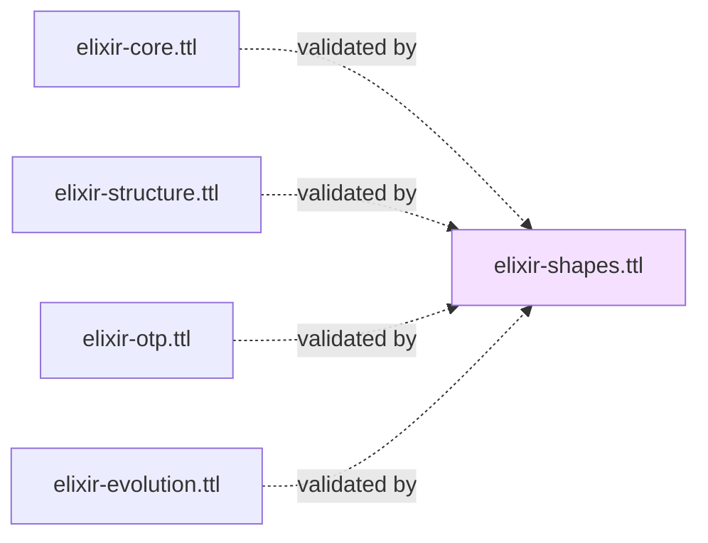
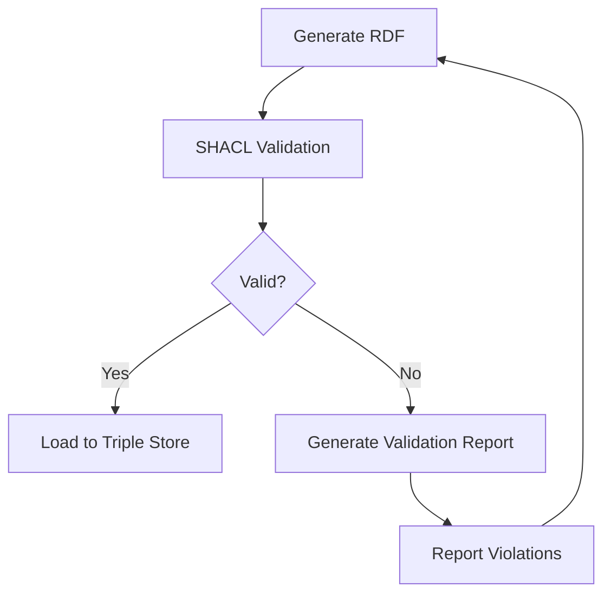

# Elixir Shapes Ontology

## Overview

The **Elixir Shapes Ontology** (`elixir-shapes.ttl`) provides SHACL (Shapes Constraint Language) validation rules for all Elixir ontology layers. While OWL provides open-world reasoning, SHACL enables closed-world validation - ensuring data completeness, type correctness, and constraint satisfaction.

**IRI**: `https://w3id.org/elixir-code/shapes`
**Size**: ~20 KB
**Dependencies**: Validates all ontology layers (no imports)
**Version**: 1.0.0

## Purpose

The Shapes Ontology provides:

1. **Node shapes** - Validation rules for each major class
2. **Property constraints** - Cardinality, datatype, and value constraints
3. **Cross-class consistency** - Rules spanning multiple classes
4. **Naming pattern validation** - Regex-based name validation
5. **Required property checks** - Ensures mandatory properties exist
6. **Value range validation** - Enumerated values, numeric ranges

## Relationship to Other Ontologies



**Validates**: All ontology layers (no imports, applies constraints)

## SHACL Concepts

### Node Shape

Defines constraints on the properties of a node:

```turtle
:ModuleShape a sh:NodeShape ;
    sh:targetClass :Module ;
    sh:property [
        sh:path :moduleName ;
        sh:datatype xsd:string ;
        sh:minCount 1 ;
        sh:maxCount 1
    ] .
```

### Property Shape

Defines reusable property constraints:

```turtle
:ModuleNamePropertyShape a sh:PropertyShape ;
    sh:path :moduleName ;
    sh:datatype xsd:string ;
    sh:pattern "^[A-Z][a-zA-Z0-9._]*$" .
```

## Key Node Shapes

### Core Layer Shapes

| Shape | Target Class | Validates |
|-------|-------------|----------|
| **ModuleShape** | Module | Module name, file reference |
| **FunctionShape** | Function | Name, arity, module membership |
| **ExpressionShape** | Expression | Base expression constraints |
| **LiteralShape** | Literal | Value property existence |
| **OperatorShape** | OperatorExpression | Operator symbol, operands |

### Structure Layer Shapes

| Shape | Target Class | Validates |
|-------|-------------|----------|
| **StructDefinitionShape** | Struct | Field definitions |
| **ProtocolShape** | Protocol | Protocol functions |
| **BehaviourShape** | Behaviour | Callback definitions |
| **GenServerShape** | GenServer | Required callbacks |
| **SupervisorShape** | Supervisor | Child specs, restart strategy |

### OTP Layer Shapes

| Shape | Target Class | Validates |
|-------|-------------|----------|
| **GenServerShape** | GenServer | Init, handle_call, etc. |
| **SupervisorShape** | Supervisor | Restart strategy, children |
| **ChildSpecShape** | ChildSpecification | All required properties |
| **ETSTableShape** | Table | Table type, access, options |

## Constraint Types

### Cardinality Constraints

```turtle
:FunctionShape a sh:NodeShape ;
    sh:property [
        sh:path :functionName ;
        sh:minCount 1 ;   # Required
        sh:maxCount 1    # Single value
    ] .
```

### Datatype Constraints

```turtle
:FunctionShape a sh:NodeShape ;
    sh:property [
        sh:path :arity ;
        sh:datatype xsd:integer ;
        sh:minInclusive 0 ;
        sh:maxInclusive 255
    ] .
```

### Pattern Constraints

```turtle
:ModuleNameShape a sh:PropertyShape ;
    sh:path :moduleName ;
    sh:pattern "^[A-Z][a-zA-Z0-9._]*$" ;
    sh:flags "i" .
```

### Enumerated Values

```turtle
:VisibilityShape a sh:PropertyShape ;
    sh:path struct:visibility ;
    sh:in ("public" "private") .
```

### Logical Constraints

```turtle
:FunctionOrMacroShape a sh:NodeShape ;
    sh:xone ( :FunctionShape :MacroShape ) .  # Exactly one
```

### Qualified Value Shapes

```turtle
:ReturnValueShape a sh:PropertyShape ;
    sh:path struct:hasReturnExpression ;
    sh:qualifiedValueShape :ExpressionShape .
```

## Naming Pattern Validations

### Module Names

```turtle
:ModuleNamePattern a sh:PropertyShape ;
    sh:path :moduleName ;
    sh:pattern "^[A-Z][a-zA-Z0-9._]*$" .

# Examples: "MyApp", "MyApp.User", "MyApp.User.Admin"
```

### Function Names

```turtle
:FunctionNamePattern a sh:PropertyShape ;
    sh:path struct:functionName ;
    sh:pattern "^[a-z_][a-zA-Z0-9_]*$" .

# Examples: "format_data", "process!", "to_string"
```

### Struct Field Names

```turtle
:StructFieldNamePattern a sh:PropertyShape ;
    sh:path struct:fieldName ;
    sh:pattern "^[a-z_][a-zA-Z0-9_]*$" .
```

## Composite Key Validation

### Function Identity

```turtle
:FunctionCompositeKey a sh:NodeShape ;
    sh:targetClass :Function ;
    sh:property [
        sh:path ( :definedInModule :functionName :arity ) ;
        sh:minCount 3
    ] .
```

## Specialized Shapes

### Function Clause Shape

```turtle
:FunctionClauseShape a sh:NodeShape ;
    sh:targetClass :FunctionClause ;

    # Must have parameters
    sh:property [
        sh:path struct:hasParameter ;
        sh:minCount 1
    ] ;

    # Must have body
    sh:property [
        sh:path struct:hasBody ;
        sh:minCount 1 ;
        sh:maxCount 1
    ] .

    # Clause index is required
    sh:property [
        sh:path struct:clauseIndex ;
        sh:datatype xsd:integer ;
        sh:minInclusive 0
    ] .
```

### GenServer Callback Shape

```turtle
:GenServerShape a sh:NodeShape ;
    sh:targetClass otp:GenServer ;

    # Must have init clause
    sh:property [
        sh:path otp:hasInitClause ;
        sh:minCount 1 ;
        sh:maxCount 1
    ] .

    # Must have at least one handle clause
    sh:property [
        sh:path ( otp:hasHandleCallClause otp:hasHandleCastClause otp:hasHandleInfoClause ) ;
        sh:minCount 1
    ] .
```

### Supervisor Shape

```turtle
:SupervisorShape a sh:NodeShape ;
    sh:targetClass otp:Supervisor ;

    # Must have restart strategy
    sh:property [
        sh:path otp:hasRestartStrategy ;
        sh:minCount 1 ;
        sh:maxCount 1 ;
        sh:in ( otp:OneForOne otp:OneForAll otp:RestForOne otp:SimpleOneForOne )
    ] .

    # Must have at least one child
    sh:property [
        sh:path otp:hasChildSpecification ;
        sh:minCount 1
    ] .
```

### Child Specification Shape

```turtle
:ChildSpecShape a sh:NodeShape ;
    sh:targetClass otp:ChildSpecification ;

    # All properties required
    sh:property [
        sh:path otp:childID ;
        sh:minCount 1 ; sh:maxCount 1
    ] ;

    sh:property [
        sh:path otp:startModule ;
        sh:minCount 1 ; sh:maxCount 1
    ] ;

    sh:property [
        sh:path otp:restartType ;
        sh:minCount 1 ; sh:maxCount 1 ;
        sh:in ( ":permanent" ":temporary" ":transient" )
    ] ;

    sh:property [
        sh:path otp:processType ;
        sh:minCount 1 ; sh:maxCount 1 ;
        sh:in ( ":worker" ":supervisor" )
    ] .
```

## Validation Workflow



### Validation Report Structure

```turtle
:ValidationReport a sh:ValidationReport ;
    sh:conforms false ;
    sh:result [
        a sh:ValidationResult ;
        sh:focusNode <#module/InvalidModule> ;
        sh:resultSeverity sh:Violation ;
        sh:resultMessage "Module name must start with capital letter" ;
        sh:sourceConstraint :ModuleNamePattern
    ] .
```

## SHACL vs OWL

| Aspect | OWL | SHACL |
|--------|-----|-------|
| **Reasoning** | Open-world | Closed-world |
| **Inference** | Class hierarchies, property characteristics | Data validation |
| **Use Case** | Schema reasoning, consistency checking | Data quality, constraint enforcement |
| **Example** | `owl:hasKey`, `rdfs:subClassOf` | `sh:minCount`, `sh:pattern` |

## SPARQL-based Validation

SHACL can be used with SPARQL constraints:

```turtle
:FunctionModuleConsistency a sh:SPARQLConstraint ;
    sh:prefixes "PREFIX struct: <https://w3id.org/elixir-code/structure#>" ;
    sh:select """
        SELECT $this ($module AS ?fail)
        WHERE {
            $this struct:definedInModule $module .
            FILTER NOT EXISTS { $module a struct:Module }
        }
    """ .
```

## Integration with Mix Tasks

### Validate During Analysis

```bash
# Enable SHACL validation
mix elixir_ontologies.analyze --validate
```

### Standalone Validation

```elixir
# In IEx
graph = ElixirOntologies.analyze("lib/my_app")
report = ElixirOntologies.Validator.validate(graph)
ElixirOntologies.Validator.print_report(report)
```

## Example: Complete Shape Definition

```turtle
# Module Shape
:ModuleShape a sh:NodeShape ;
    sh:targetClass struct:Module ;

    # Module name (required, string, pattern)
    sh:property [
        sh:path struct:moduleName ;
        sh:datatype xsd:string ;
        sh:minCount 1 ;
        sh:maxCount 1 ;
        sh:pattern "^[A-Z][a-zA-Z0-9._]*$"
    ] ;

    # Must define at least one function or struct
    sh:sparql """
        PREFIX struct: <https://w3id.org/elixir-code/structure#>

        SELECT $this
        WHERE {
            $this struct:definesFunction/?struct:definesStruct ?any .
        }
    """ .

# Function Shape
:FunctionShape a sh:NodeShape ;
    sh:targetClass struct:Function ;

    # Function name (required, pattern)
    sh:property [
        sh:path struct:functionName ;
        sh:datatype xsd:string ;
        sh:minCount 1 ;
        sh:maxCount 1 ;
        sh:pattern "^[a-z_][a-zA-Z0-9_!?]*$"
    ] ;

    # Arity (required, non-negative integer)
    sh:property [
        sh:path struct:arity ;
        sh:datatype xsd:integer ;
        sh:minCount 1 ;
        sh:maxCount 1 ;
        sh:minInclusive 0 ;
        sh:maxInclusive 255
    ] ;

    # Visibility (optional, public/private)
    sh:property [
        sh:path struct:visibility ;
        sh:datatype xsd:string ;
        sh:maxCount 1 ;
        sh:in ("public" "private")
    ] ;

    # Must have at least one clause
    sh:property [
        sh:path struct:hasClause ;
        sh:minCount 1
    ] .

    # Must belong to a module
    sh:property [
        sh:path struct:definedInModule ;
        sh:minCount 1 ;
        sh:maxCount 1 ;
        sh:class struct:Module
    ] .
```

## Validation Examples

### Example 1: Invalid Module Name

```turtle
<#module/invalidModule> a struct:Module ;
    struct:moduleName "invalid_name" .
```

**Validation Result**: Violation - Module name must start with capital letter

### Example 2: Missing Function Name

```turtle
<#func/no-name> a struct:Function ;
    struct:arity 0 .
```

**Validation Result**: Violation - Function name is required

### Example 3: Invalid Arity

```turtle
<#func/negative-arity> a struct:Function ;
    struct:functionName "foo" ;
    struct:arity -1 .
```

**Validation Result**: Violation - Arity must be >= 0

### Example 4: Valid Module

```turtle
<#module/MyApp.User> a struct:Module ;
    struct:moduleName "MyApp.User" ;
    struct:definesFunction <#func/MyApp.User.new/1> .

<#func/MyApp.User.new/1> a struct:Function ;
    struct:functionName "new" ;
    struct:arity 1 ;
    struct:visibility "public" ;
    struct:definedInModule <#module/MyApp.User> ;
    struct:hasClause [
        rdf:first <#clause/0> ;
        rdf:rest rdf:nil
    ] .
```

**Validation Result**: Conforms - All constraints satisfied

## Related Ontologies

- **[Core Ontology](core.md)** - Classes being validated
- **[Structure Ontology](structure.md)** - Module and Function shapes
- **[OTP Ontology](otp.md)** - GenServer and Supervisor shapes

## References

- [SHACL Specification](https://www.w3.org/TR/shacl/)
- [SHACL Playground](https://shacl-playground.herokuapp.com/)
- [SHACL Advanced Features](https://www.w3.org/TR/shacl-af/)
