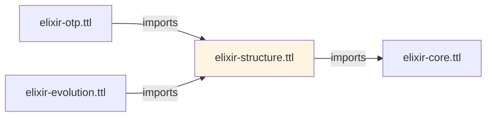
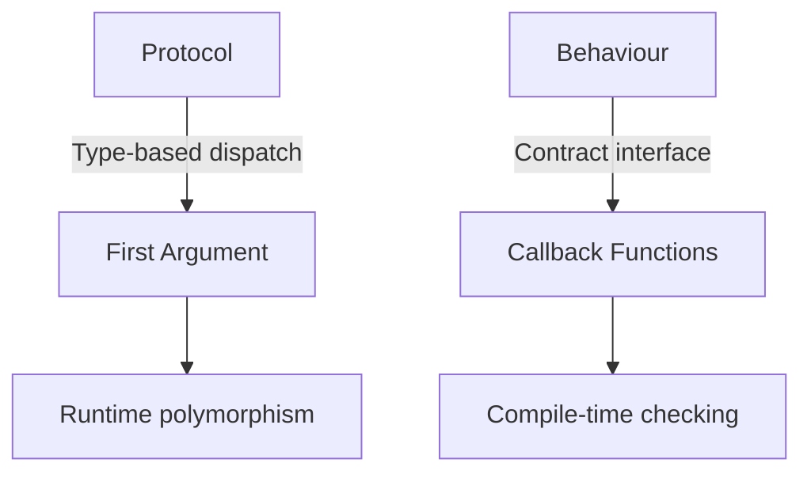

# Elixir Structure Ontology

## Overview

The **Elixir Structure Ontology** (`elixir-structure.ttl`) defines Elixir-specific language constructs built on the Core ontology's foundational types. It models the module system, function definitions, protocols, behaviours, macros, and type specifications that form the backbone of Elixir application architecture.

**IRI**: `https://w3id.org/elixir-code/structure`
**Size**: ~48 KB
**Dependencies**: `elixir-core.ttl` (imports)
**Version**: 1.0.0

## Purpose

The Structure Ontology provides:

1. **Module system** - Namespaces, nesting, and module attributes
2. **Function definitions** - Named and anonymous functions with clauses
3. **Protocol polymorphism** - Type-based dispatch mechanisms
4. **Behaviour contracts** - Callback definitions and implementations
5. **Macro system** - Compile-time metaprogramming constructs
6. **Type specifications** - Typespecs and dialyzer types
7. **Struct definitions** - Named maps with compile-time guarantees
8. **Use/Require/Alias** - Module directive handling

## Relationship to Other Ontologies



**Imports**: `elixir-core.ttl`

**Imported by**:
- `elixir-otp.ttl` (for GenServer, Supervisor callbacks)
- `elixir-evolution.ttl` (for versioning Module and Function entities)

## Class Hierarchy

```
CodeElement (from Core)
├── Module (namespace container)
│   ├── ModuleAttribute
│   ├── Function
│   │   ├── FunctionClause
│   │   │   ├── Parameter
│   │   │   ├── Guard
│   │   │   └── ReturnExpression
│   ├── Macro
│   ├── MacroClause
│   ├── Protocol
│   │   └── ProtocolImplementation
│   ├── Behaviour
│   │   └── BehaviourImplementation
│   ├── Struct
│   │   └── StructField
│   ├── TypeDefinition
│   │   └── TypeExpression
│   ├── FunctionSpec
│   ├── Callback
│   ├── UseDirective
│   ├── RequireDirective
│   ├── AliasDirective
│   └── ImportDirective
```

## Key Classes

### Module

Represents an Elixir module - the primary namespace and compilation unit.

| Property | Domain | Range | Description |
|----------|--------|-------|-------------|
| **moduleName** | Module | xsd:string | Fully qualified module name |
| **definedInFile** | Module | SourceFile | Source file containing module |
| **hasModuleAttribute** | Module | ModuleAttribute | Module-level attributes |
| **definesFunction** | Module | Function | Functions defined in module |
| **definesMacro** | Module | Macro | Macros defined in module |
| **definesStruct** | Module | Struct | Structs defined in module |
| **definesProtocol** | Module | Protocol | Protocols defined in module |
| **implementsBehaviour** | Module | BehaviourImplementation | Behaviours implemented |
| **implementsProtocol** | Module | ProtocolImplementation | Protocols implemented |
| **hasTypeDefinition** | Module | TypeDefinition | Type specs defined |
| **hasUseDirective** | Module | UseDirective | Use statements |
| **nestedIn** | Module | Module | Parent module (if nested) |
| **hasNestedModule** | Module | Module | Child modules |

**Example**:
```turtle
<#module/StringIO> a :Module ;
    :moduleName "StringIO" ;
    :definedInFile <#file/lib/string_io.ex> .
```

### Function

Represents a named function definition with clauses for pattern matching.

| Property | Domain | Range | Description |
|----------|--------|-------|-------------|
| **functionName** | Function | xsd:string | Function name (atom as string) |
| **arity** | Function | xsd:integer | Number of parameters |
| **visibility** | Function | xsd:string | `"public"` or `"private"` |
| **definedInModule** | Function | Module | Containing module |
| **hasClause** | Function | rdf:List | Function clauses (ordered) |
| **hasSpec** | Function | FunctionSpec | Optional typespec |
| **isCallback** | Function | xsd:boolean | True if behaviour callback |
| **isDefault** | Function | xsd:boolean | True if protocol default impl |

**Composite Key**: `(definedInModule, functionName, arity)` via `owl:hasKey`

**Example**:
```turtle
<#func/StringIO.flush/1> a :Function ;
    :functionName "flush" ;
    :arity 1 ;
    :visibility "public" ;
    :definedInModule <#module/StringIO> ;
    :hasClause [
        rdf:first <#clause/0> ;
        rdf:rest rdf:nil
    ] .
```

### FunctionClause

Represents a single clause in a pattern-matched function definition.

| Property | Domain | Range | Description |
|----------|--------|-------|-------------|
| **hasParameter** | FunctionClause | rdf:List | Parameters (ordered) |
| **hasGuard** | FunctionClause | Guard | Optional guard expression |
| **hasBody** | FunctionClause | Expression | Clause body |
| **clauseIndex** | FunctionClause | xsd:integer | Clause position (for ordering) |

**Example**:
```turtle
<#clause/0> a :FunctionClause ;
    :hasParameter [
        rdf:first <#param/0> ;
        rdf:rest rdf:nil
    ] ;
    :hasBody <#expr/body> .
```

### Parameter

Represents a function parameter with optional type and default value.

| Property | Domain | Range | Description |
|----------|--------|-------|-------------|
| **parameterName** | Parameter | xsd:string | Parameter name |
| **parameterIndex** | Parameter | xsd:integer | Position in parameter list |
| **hasPattern** | Parameter | Pattern | Pattern for destructuring |
| **hasTypeAnnotation** | Parameter | TypeExpression | Optional type annotation |

### Guard

Represents a guard expression for clause conditional matching.

| Property | Domain | Range | Description |
|----------|--------|-------|-------------|
| **hasGuardExpression** | Guard | Expression | Guard conditions (and/or combined) |

### Protocol

Represents a protocol definition - polymorphism based on data type.

| Property | Domain | Range | Description |
|----------|--------|-------|-------------|
| **protocolName** | Protocol | xsd:string | Protocol name |
| **definedInModule** | Protocol | Module | Defining module |
| **hasFunction** | Protocol | Function | Protocol functions |
| **hasFallbackTo** | Protocol | Module | Fallback module (Any) |

**Key Distinction**: Protocols use type-based dispatch on first argument.

### ProtocolImplementation

Represents implementation of a protocol for a specific type.

| Property | Domain | Range | Description |
|----------|--------|-------|-------------|
| **implementsProtocol** | ProtocolImplementation | Protocol | Protocol being implemented |
| **forType** | ProtocolImplementation | xsd:string | Type name being implemented |
| **definedInModule** | ProtocolImplementation | Module | Implementation module |

### Behaviour

Represents a behaviour definition - callback contract interface.

| Property | Domain | Range | Description |
|----------|--------|-------|-------------|
| **behaviourName** | Behaviour | xsd:string | Behaviour name |
| **definedInModule** | Behaviour | Module | Defining module |
| **hasCallback** | Behaviour | Callback | Required callbacks |

**Key Distinction**: Behaviours define callback contracts (not dispatch mechanism).

### BehaviourImplementation

Represents module implementing a behaviour's callbacks.

| Property | Domain | Range | Description |
|----------|--------|-------|-------------|
| **implementsBehaviour** | BehaviourImplementation | Behaviour | Behaviour being implemented |
| **definedInModule** | BehaviourImplementation | Module | Implementing module |
| **hasCallbackImplementation** | BehaviourImplementation | Function | Callback function |

### Struct

Represents a struct definition - named map with compile-time schema.

| Property | Domain | Range | Description |
|----------|--------|-------|-------------|
| **structName** | Struct | xsd:string | Struct name |
| **definedInModule** | Struct | Module | Defining module |
| **hasField** | Struct | StructField | Struct fields |
| **extendsStruct** | Struct | Struct | Parent struct (for inheritance) |

### StructField

Represents a field in a struct definition.

| Property | Domain | Range | Description |
|----------|--------|-------|-------------|
| **fieldName** | StructField | xsd:string | Field name (atom as string) |
| **hasDefaultValue** | StructField | Literal | Default value (optional) |
| **hasTypeAnnotation** | StructField | TypeExpression | Optional type annotation |

### ModuleAttribute

Represents a module attribute (`@attr value`).

| Property | Domain | Range | Description |
|----------|--------|-------|-------------|
| **attributeName** | ModuleAttribute | xsd:string | Attribute name |
| **attributeValue** | ModuleAttribute | Literal | Attribute value |
| **isCompileTime** | ModuleAttribute | xsd:boolean | True if compile-time only |

**Common Attributes**:
- `@moduledoc` - Module documentation
- `@doc` - Function documentation
- `@spec` - Type specification
- `@callback` - Behaviour callback
- `@macrocallback` - Macro callback
- `@optional_callbacks` - Optional behaviour callbacks
- `@behaviour` - Behaviour declaration
- `@impl` - Behaviour implementation marker
- `@enforce_keys` - Struct required keys

### Macro

Represents a macro definition (compile-time code generation).

| Property | Domain | Range | Description |
|----------|--------|-------|-------------|
| **macroName** | Macro | xsd:string | Macro name |
| **arity** | Macro | xsd:integer | Number of parameters |
| **definedInModule** | Macro | Module | Defining module |
| **hasClause** | Macro | rdf:List | Macro clauses |

### TypeDefinition

Represents a @type or @typep specification.

| Property | Domain | Range | Description |
|----------|--------|-------|-------------|
| **typeName** | TypeExpression | xsd:string | Type name |
| **isPublic** | TypeDefinition | xsd:boolean | True if @type, false if @typep |
| **hasTypeExpression** | TypeExpression | TypeExpression | Type definition |
| **definedInModule** | TypeExpression | Module | Defining module |

### FunctionSpec

Represents a @spec type specification for a function.

| Property | Domain | Range | Description |
|----------|--------|-------|-------------|
| **specifiesFunction** | FunctionSpec | Function | Function being specified |
| **hasInputTypes** | FunctionSpec | rdf:List | Parameter types (ordered) |
| **hasReturnType** | FunctionSpec | TypeExpression | Return type |

### Callback

Represents a @callback specification in a behaviour.

| Property | Domain | Range | Description |
|----------|--------|-------|-------------|
| **callbackName** | Callback | xsd:string | Callback name |
| **arity** | Callback | xsd:integer | Number of parameters |
| **definedInBehaviour** | Callback | Behaviour | Defining behaviour |
| **isOptional** | Callback | xsd:boolean | True if in @optional_callbacks |

### Module Directives

#### UseDirective

```turtle
<#use/0> a :UseDirective ;
    :usesModule <#module/GenServer> ;
    :hasOptions [ ... ] .
```

#### RequireDirective

```turtle
<#require/0> a :RequireDirective ;
    :requiresModule <#module/Macros> ;
    :as "Macros" .
```

#### AliasDirective

```turtle
<#alias/0> a :AliasDirective ;
    :aliasesModule <#module/VeryLongModuleName> ;
    :as "ShortName" .
```

#### ImportDirective

```turtle
<#import/0> a :ImportDirective ;
    :importsFrom <#module/List> ;
    :importsFunctions [:flatten, :map] .
```

## Design Patterns

### 1. Protocol vs Behaviour



**Protocols**:
- Dispatch on first argument type
- Multiple implementations per type
- Built-in types supported via `defprotocol`
- Fallback to `Any` protocol

**Behaviours**:
- Define callback contracts
- Modules implement callbacks
- Compile-time verification with `@impl`
- Used for OTP (GenServer, Supervisor)

### 2. Composite Key for Functions

```turtle
:Function a owl:Class ;
    owl:hasKey ( :definedInModule :functionName :arity ) .
```

This ensures unique function identity: `StringIO.flush/1` is distinct from `IO.flush/1`.

### 3. RDF Lists for Clauses

Function clauses maintain order via RDF lists (important for pattern matching semantics):

```turtle
<#func/my_fun/2> :hasClause [
    rdf:first <#clause/0> ;  # First pattern match
    rdf:rest [
        rdf:first <#clause/1> ;  # Second pattern match
        rdf:rest rdf:nil
    ]
] .
```

## SPARQL Query Examples

### Find All Public Functions in a Module

```sparql
PREFIX core: <https://w3id.org/elixir-code/core#>
PREFIX struct: <https://w3id.org/elixir-code/structure#>

SELECT ?func_name ?arity WHERE {
  ?module a struct:Module ;
           struct:moduleName "StringIO" ;
           struct:definesFunction ?func .

  ?func a struct:Function ;
        struct:functionName ?func_name ;
        struct:arity ?arity ;
        struct:visibility "public" .
}
```

### Find All Protocol Implementations

```sparql
PREFIX struct: <https://w3id.org/elixir-code/structure#>

SELECT ?protocol ?type ?impl_module WHERE {
  ?impl a struct:ProtocolImplementation ;
        struct:implementsProtocol ?protocol ;
        struct:forType ?type ;
        struct:definedInModule ?impl_module .

  ?protocol struct:protocolName ?proto_name .
}
```

### Find All Behaviour Callbacks

```sparql
PREFIX struct: <https://w3id.org/elixir-code/structure#>

SELECT ?behaviour ?callback_name ?arity WHERE {
  ?behaviour a struct:Behaviour ;
              struct:behaviourName ?b_name ;
              struct:hasCallback ?callback .

  ?callback a struct:Callback ;
             struct:callbackName ?callback_name ;
             struct:arity ?arity .
}
```

### Find Functions with Type Specs

```sparql
PREFIX struct: <https://w3id.org/elixir-code/structure#>

SELECT ?func ?module WHERE {
  ?func a struct:Function ;
        struct:hasSpec ?spec .

  ?func struct:definedInModule ?module .
}
```

## Example: Complete Module Representation

```turtle
<#module/MyApp.User> a struct:Module ;
    struct:moduleName "MyApp.User" ;
    struct:definedInFile <#file/lib/my_app/user.ex> ;

    # Module attributes
    struct:hasModuleAttribute <#attr/moduledoc> ;
    struct:hasModuleAttribute <#attr/schema> ;

    # Struct definition
    struct:definesStruct <#struct/User> ;

    # Functions
    struct:definesFunction <#func/new/2> ;
    struct:definesFunction <#func/changeset/2> ;

    # Type definitions
    struct:hasTypeDefinition <#type/t> ;
    struct:hasTypeDefinition <#type/changeset> .

<#attr/moduledoc> a struct:ModuleAttribute ;
    struct:attributeName "moduledoc" ;
    struct:attributeValue "User schema and changeset functions" .

<#struct/User> a struct:Struct ;
    struct:structName "User" ;
    struct:hasField <#field/id> ;
    struct:hasField <#field/name> ;
    struct:hasField <#field/email> .

<#field/id> a struct:StructField ;
    struct:fieldName "id" ;
    struct:hasTypeAnnotation struct:IDType .

<#func/new/2> a struct:Function ;
    struct:functionName "new" ;
    struct:arity 2 ;
    struct:visibility "public" ;
    struct:hasSpec <#spec/new> .

<#spec/new> a struct:FunctionSpec ;
    struct:specifiesFunction <#func/new/2> ;
    struct:hasReturnType struct:UserStruct .
```

## Related Ontologies

- **[Core Ontology](core.md)** - Foundation for AST nodes and expressions
- **[OTP Ontology](otp.md)** - Uses Structure for GenServer callbacks
- **[Evolution Ontology](evolution.md)** - Versions Module and Function entities

## References

- [Elixir Module Documentation](https://hexdocs.pm/elixir/Module.html)
- [Protocol Documentation](https://hexdocs.pm/elixir/Protocol.html)
- [Behaviour Documentation](https://hexdocs.pm/elixir/Behaviour.html)
