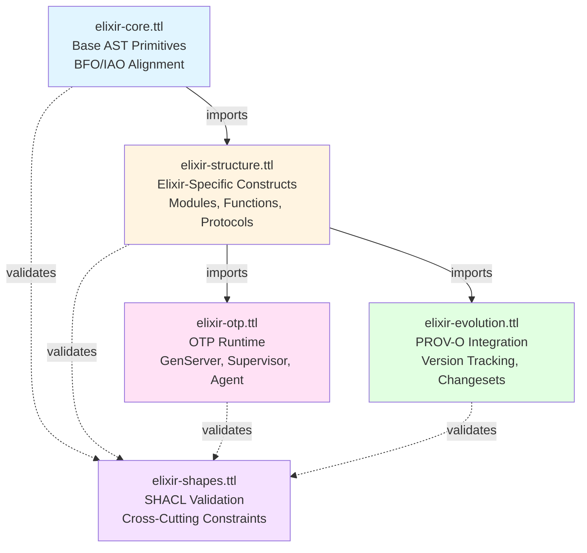

# Elixir Ontologies Overview

This guide provides an overview of the Elixir Ontologies suite - a comprehensive OWL ontology for modeling Elixir code structure, behavior, and evolution.

## Introduction

The Elixir Ontologies transform Elixir source code into semantic knowledge graphs using RDF (Resource Description Framework) and OWL (Web Ontology Language). This enables:

- **Code Analysis**: SPARQL queries across code structure
- **Provenance Tracking**: Version history and change tracking
- **Code Generation**: LLM-driven code synthesis
- **Validation**: SHACL-based constraint checking
- **Documentation**: Auto-generated from ontology

## Ontology Architecture

The ontology suite is organized as a four-layer modular architecture with explicit import dependencies:



## Ontology Files

| File | Purpose | Size | Key Classes |
|------|---------|------|-------------|
| **elixir-core.ttl** | Base AST primitives and foundational types | ~44 KB | Expression, Pattern, Literal, Operator |
| **elixir-structure.ttl** | Elixir-specific language constructs | ~48 KB | Module, Function, Protocol, Behaviour, Macro |
| **elixir-otp.ttl** | OTP runtime behaviors and patterns | ~30 KB | GenServer, Supervisor, Agent, Task, ETS |
| **elixir-evolution.ttl** | Version tracking and provenance | ~28 KB | Entity, Version, Changeset, Activity |
| **elixir-shapes.ttl** | SHACL validation constraints | ~20 KB | Node shapes, property constraints |

## Layer Relationships

### 1. Core Layer (elixir-core.ttl)

**Purpose**: Foundational ontology defining base AST primitives and aligning with upper ontologies (BFO, IAO).

**Key Concepts**:
- Expression types (literal, operator, variable, control flow)
- Pattern matching constructs
- Data type system
- External alignments (BFO, IAO, PROV-O)

**Dependencies**: None (base layer)

### 2. Structure Layer (elixir-structure.ttl)

**Purpose**: Elixir-specific language constructs built on core primitives.

**Key Concepts**:
- Module system and namespace organization
- Function definitions (named, anonymous)
- Protocol and behaviour polymorphism
- Macro system
- Type specifications

**Dependencies**: Imports `elixir-core.ttl`

### 3. OTP Layer (elixir-otp.ttl)

**Purpose**: Models OTP runtime behaviors and design patterns.

**Key Concepts**:
- GenServer callbacks and state management
- Supervisor trees and restart strategies
- Agent, Task, and ETS tables
- Child specifications and application supervision

**Dependencies**: Imports `elixir-structure.ttl`

### 4. Evolution Layer (elixir-evolution.ttl)

**Purpose**: Tracks code changes over time using PROV-O provenance model.

**Key Concepts**:
- Entity versioning with named graphs
- Changeset generation (additions, deletions, modifications)
- Activity classification (creation, modification, refactoring, deprecation)
- Author and commit metadata

**Dependencies**: Imports `elixir-structure.ttl`

### 5. Shapes Layer (elixir-shapes.ttl)

**Purpose**: Cross-cutting SHACL validation constraints.

**Key Concepts**:
- Node shapes for each major class
- Property constraints (cardinality, datatype, value ranges)
- Cross-class consistency rules
- Naming pattern validations

**Dependencies**: Validates all layers (no imports, applies constraints)

## IRI Convention

All ontology resources use hierarchical IRIs under `https://w3id.org/elixir-code/`:

```
https://w3id.org/elixir-code/{module}#{ClassName}
https://w3id.org/elixir-code/{module}#{propertyName}
```

Example IRIs:
- `https://w3id.org/elixir-code/core#Module`
- `https://w3id.org/elixir-code/structure#definesFunction`
- `https://w3id.org/elixir-code/otp#GenServer`

## External Dependencies

| Ontology | Purpose | Namespace |
|----------|---------|-----------|
| **BFO** | Basic Formal Ontology - foundational classes | `http://purl.obolibrary.org/obo/` |
| **IAO** | Information Artifact Ontology - information entities | `http://purl.obolibrary.org/obo/IAO_` |
| **PROV-O** | W3C Provenance Ontology - provenance tracking | `http://www.w3.org/ns/prov#` |
| **SHACL** | Shapes Constraint Language - validation rules | `http://www.w3.org/ns/shacl#` |
| **OWL** | Web Ontology Language - ontology modeling | `http://www.w3.org/2002/07/owl#` |
| **RDF** | Resource Description Framework - triples | `http://www.w3.org/1999/02/22-rdf-syntax-ns#` |
| **RDFS** | RDF Schema - schema vocabulary | `http://www.w3.org/2000/01/rdf-schema#` |
| **XSD** | XML Schema Datatypes - literal types | `http://www.w3.org/2001/XMLSchema#` |

## Design Principles

### 1. Composite Key Identity

Functions are identified by composite key `(Module, Name, Arity)` via `owl:hasKey`:

```turtle
:Function a owl:Class ;
    owl:hasKey (:definedInModule :functionName :arity) .
```

### 2. Ordered Collections

Function clauses and pattern alternatives use RDF lists to preserve evaluation order:

```turtle
:hasClause a rdf:List ;
    rdf:first <#clause/0> ;
    rdf:rest [rdf:first <#clause/1> ; rdf:rest rdf:nil] .
```

### 3. Pattern Matching Semantics

Protocols and behaviours are distinguished by dispatch mechanism:
- **Protocols**: Type-based dispatch on first argument
- **Behaviours**: Callback contract definitions

### 4. Temporal Tracking

Version tracking uses:
- **RDF-star** for statement-level provenance
- **Named graphs** for version snapshots
- **PROV-O activities** for change classification

### 5. Validation Strategy

- **OWL axioms** for open-world reasoning
- **SHACL shapes** for closed-world constraints
- Node shapes validate entity completeness
- Property shapes validate data correctness

## Usage Patterns

### Code Analysis Query

Find all functions that handle a specific message type:

```sparql
PREFIX core: <https://w3id.org/elixir-code/core#>
PREFIX otp: <https://w3id.org/elixir-code/otp#>

SELECT ?function ?module WHERE {
  ?server a otp:GenServer ;
          core:definedInModule ?module ;
          otp:hasHandleClause ?clause .

  ?clause otp:handlesMessage "handle_info" ;
           otp:patternMessage ?msg .

  ?msg core:atomValue ":state_timeout" .
  ?server otp:hasCallback ?function .
}
```

### Evolution Tracking Query

Track changes to a function across versions:

```sparql
PREFIX prov: <http://www.w3.org/ns/prov#>
PREFIX core: <https://w3id.org/elixir-code/core#>

SELECT ?version ?activity ?timestamp WHERE {
  GRAPH ?version {
    ?function a core:Function ;
               core:functionName "my_function" .
  }

  ?activity prov:generated ?function ;
             prov:endedAtTime ?timestamp .
}
```

## Next Steps

- **[Getting Started Guide](getting-started.md)** - Learn how to use the mix tasks
- **[Core Ontology Guide](ontology/core.md)** - Base AST primitives
- **[Structure Ontology Guide](ontology/structure.md)** - Elixir language constructs
- **[OTP Ontology Guide](ontology/otp.md)** - OTP runtime patterns
- **[Evolution Ontology Guide](ontology/evolution.md)** - Version tracking
- **[Shapes Ontology Guide](ontology/shapes.md)** - Validation constraints
